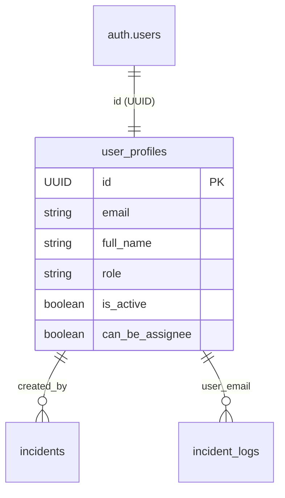

# 📘 DOWA IT System - Technical Documentation (Multi-Tier RBAC)

เอกสารฉบับนี้สรุปโครงสร้างระบบบริหารจัดการผู้ใช้ (User Management) และการรักษาความปลอดภัยที่มีการแบ่งเป็น 4 ระดับ (Tiers) เพื่อใช้เป็นมาตรฐานในการพัฒนาและแก้ไขระบบ

---

## 1. Data Structure & Relations (โครงสร้างฐานข้อมูล)

ระบบใช้ฐานข้อมูล Supabase โดยแบ่งการจัดเก็บผู้ใช้เป็น 2 ประเภทหลักที่เชื่อมโยงกันด้วย **Email** ผ่านตารางกลาง (Bridge Table)

### 🧩 ตารางหลัก
### 1. Unified Identity Strategy
- **Core Platform**: Supabase Auth (Email/Password & Microsoft 365 SSO)
- **Source of Truth**: `user_profiles` (Single table for all roles)
- **Unified Auth Flow**: All users (Administrator to Guest) use a single login interface.

#### Data Relation (Unified)

> [!NOTE]
> **Legacy Deprecation:** The tables `user_registry` and `external_users` are now deprecated and will be removed in future updates.

---

## 2. Multi-Tier RBAC (Unified Tiers)

All tiers now use standard authentication protocols.

| Tier | Role Name | Access Level | Auth Method |
| :---: | :--- | :--- | :--- |
| **Tier 1** | administrator | Full System Control | Email/Pass or M365 |
| **Tier 2** | supervisor | Operation & Reports | Email/Pass or M365 |
| **Tier 3** | approval | Specific Case Approvals | Email/Pass or M365 |
| **Tier 4** | guest | Create/View Incidents | Email/Pass or M365 |

> [!IMPORTANT]
> **Normalization:** ระบบใช้ฟังก์ชัน `normalizeRole()` ใน `lib/auth.js` เพื่อแปลงค่าเก่า (เช่น `superuser` -> `administrator`, `visitor` -> `guest`) ให้เป็นมาตรฐานเดียวกันก่อนแสดงผลหรือเช็คสิทธิ์

---

## 3. Module & Function Mapping (ตำแหน่งของฟังก์ชัน)

### 🛡️ Admin Operations (การจัดการโดย Admin)
**File Path:** `app/actions/admin.js`
- `createAdminUser`: สร้างผู้ใช้ใหม่ (แยก Logic ตาม Tier)
- `updateAdminUser`: แก้ไขข้อมูลทั่วไป/สถานะ Active
- `updateAdminUserPassword`: Reset รหัสผ่านให้ Staff (Internal)
- `updateAdminUserPIN`: Reset PIN 6 หลักให้ Guest/Approval (External)

### 🔑 Authentication & Self-Service (การเข้าสู่ระบบและจัดการตนเอง)
**File Path:** `app/actions/auth.js`
- `unifiedLogin`: ระบบ Login ตัวเดียวที่เช็คทั้ง Password และ PIN
- `getCurrentUserSession`: ดึงข้อมูลผู้ใช้ปัจจุบัน (รองรับทั้ง Cookie และ Supabase Session)
- `changeExternalPIN`: ฟังก์ชันให้ Guest เปลี่ยน PIN ด้วยตัวเอง (ต้องเช็ค PIN เดิม)

### 🏗️ Shared Library
**File Path:** `lib/auth.js`
- `ROLE_MAP`: การจับคู่ชื่อ Role
- `ROUTE_PERMISSIONS`: การกำหนดสิทธิ์เข้าถึงแต่ละหน้า (Access Control)
- `ROLE_BADGE`: ข้อมูลสีและ Emoji ของแต่ละบทบาท

---

## 4. Security Protocols (ระเบียบความปลอดภัย)

1.  **Password (Internal):** บังคับขั้นต่ำ 8 ตัวอักษร, มีอักษรพิมพ์ใหญ่, พิมพ์เล็ก, ตัวเลข และอักขระพิเศษ
2.  **PIN (External):** บังคับเป็น **ตัวเลข 6 หลักเท่านั้น**
3.  **Encryption:** ทั้ง Password และ PIN จะถูกเข้ารหัสแบบ One-way Hash ก่อนลง Database เสมอ (Password โดย Supabase / PIN โดย Bcrypt)
4.  **Session Management:**
    - Staff ใช้ Supabase Session (JWT ใน Cookie `sb-access-token`)
    - External ใช้ Custom Cookie (Cookie `guest-session` เข้ารหัส Base64)

---
## 5. User Management Workflow (กระบวนการจัดการผู้ใช้)

เพื่อให้การบำรุงรักษาระบบเป็นไปอย่างถูกต้อง นี่คือลำดับการทำงาน (Flow) ของระบบจัดการผู้ใช้:

### 1. การสร้างบัญชี (User Creation)
- **จุดเริ่มต้น:** หน้าจอ Admin Dashboard -> `createAdminUser`
- **ขั้นตอน:**
    1. สร้างบัญชีใน **Supabase Auth** (Email/Password)
    2. นำ Email มาทำ **SHA-256 Hash** แล้วบันทึกลงใน `user_whitelist` (Double-Lock Step)
    3. บันทึกข้อมูลส่วนตัว (Role, Name) ลงใน `user_profiles`
- **หมายเหตุ:** หากขั้นตอนใดล้มเหลว ระบบจะทำการ Rollback หรือแจ้งเตือนจุดที่ผิดพลาดชัดเจน

### 2. การเข้าสู่ระบบ (Authentication)
- **จุดเริ่มต้น:** หน้า Login -> `unifiedLogin`
- **ขั้นตอนการตรวจสอบ:**
    1. **Whitelist Check:** ระบบจะนำ Email มา Hash และเช็คใน `user_whitelist` ก่อนเป็นด่านแรก (ถ้าไม่มีสิทธิ์จะถูกบล็อกทันที)
    2. **Auth Check:** ตรวจสอบรหัสผ่านผ่าน Supabase Auth หรือตรวจสอบ Microsoft SSO
    3. **Role Validation:** ดึงข้อมูล Role จาก `user_profiles` เพื่อกำหนดสิทธิ์การเข้าถึงหน้าต่างๆ
- **Session:** สร้าง JWT สำหรับพนักงาน และ Custom Cookie สำหรับ Guest/Approval

### 3. การตรวจสอบสิทธิ์ (Security Definition)
- **Handle New User:** ใช้ Database Trigger `handle_new_user()` ที่เป็น `SECURITY DEFINER` เพื่อให้ระบบสามารถเขียนข้อมูลลง Profile ได้อย่างปลอดภัยแม้ผู้ใช้จะยังไม่มีสิทธิ์ในตอนแรก

---
## 📜 Change Logs (บันทึกการเปลี่ยนแปลง)

### [2026-04-30] - Vercel Production Stability & Action Restructuring
- **Login Reliability Fix (Vercel):** แก้ไขปัญหา Login ไม่ได้บน Vercel Production โดยการเปลี่ยนจากการใช้ Server Action มาเป็น **API-based Auth (`/api/auth/check-tier`)** เพื่อความเสถียรสูงสุด
- **Action Restructuring:** แยกไฟล์ Server Action ออกเป็นส่วนๆ เพื่อลดปัญหา Dependency Conflict บน Serverless Environment:
  - `status.js`: ตรวจสอบประเภทผู้ใช้ (Native Fetch)
  - `login.js`: จัดการการเข้าสู่ระบบ (Isolated Bcrypt)
  - `user.js`: จัดการ Session และข้อมูล Profile
- **Infrastructure Security:** เพิ่มหน้า **System Diagnostic (`/debug-env`)** สำหรับตรวจสอบสถานะ Environment Variables บน Vercel โดยไม่เปิดเผยค่าความลับ
- **Auth Hardening:** เพิ่มระบบดักจับ Error และตรวจสอบตัวแปรสภาพแวดล้อมก่อนเริ่มทำงาน เพื่อป้องกันปัญหา Error 500
- **Test User Sync:** กู้คืนและซิงค์บัญชี `Antigravity` (exam@123.com) ให้สามารถใช้งานบนระบบจริงได้สำหรับการทดสอบ
- **Backup Functionality Fix:** แก้ไข Bug ฟังก์ชัน Backup Log ที่บันทึก/ลบข้อมูลไม่ได้ และแก้ไขปัญหา Timezone ที่ซ่อนข้อมูลวันสุดท้ายของเดือน
- **UI Auto-Refresh:** เพิ่มระบบ Auto-refresh (ทุก 5 นาที) ในหน้า Dashboard และ Backup Log เพื่อให้ข้อมูลอัปเดตตลอดเวลาโดยไม่ต้องรีเฟรชหน้าจอเอง
- **Numeric Date Formatting:** เพิ่มฟังก์ชัน `formatDateNumeric` เพื่อแสดงผลวันที่ในรูปแบบ `dd/mm/yyyy` และนำไปใช้ในหน้า SLA Compliance Dashboard ทั้งส่วนฟิลเตอร์และตารางรายการ

---

## 🚀 5. Pending Infrastructure Tasks (งานที่รอการดำเนินการ)

หัวข้อนี้ระบุงานส่วนโครงสร้างพื้นฐานที่ต้องประสานงานกับผู้ดูแลโดเมน (Outsource) เพื่อให้ระบบทำงานได้สมบูรณ์:

### 📧 การตั้งค่า Resend.com (ระบบส่งอีเมล) - [COMPLETED]
ระบบได้รับการรวมศูนย์ไว้ที่ `lib/resend.js` และตั้งค่าให้ใช้โดเมนบริษัทที่ได้รับการยืนยันแล้ว:
1.  **Domain Verification:** ยืนยันโดเมน `dowa-tht.co.th` เรียบร้อยแล้ว (Cloudflare DNS)
2.  **Sender Identity:** เปลี่ยนจาก `onboarding@resend.dev` เป็น `noreply@dowa-tht.co.th` ทั่วทั้งระบบ
3.  **Unified Utility:** ใช้ `sendEmail` จาก `@/lib/resend` เพื่อความสม่ำเสมอและจัดการ Error ได้ดีขึ้น

### [2026-05-01] - Security Hardening, Standardization & Audit Readiness
- **Core Development Standards:** จัดทำไฟล์ `DEVELOPMENT_STANDARDS.md` เพื่อเป็น "หัวใจหลัก" ในการควบคุมมาตรฐานความปลอดภัย, การเก็บ Log และคุณภาพโค้ดระดับ Enterprise
- **Double-Lock Identity Whitelist:** นำระบบ **"ทะเบียนขาวลับ" (`user_whitelist`)** มาใช้เพื่อเป็นด่านตรวจที่สอง ป้องกันปัญหาการสร้างโปรไฟล์อัตโนมัติจาก Database Triggers
- **Identity Hashing (SHA-256):** เข้ารหัสอีเมลในทะเบียนขาวเป็น SHA-256 Hash เพื่อความปลอดภัยสูงสุด (Privacy-by-Design)
- **Proactive Auto-Purge:** พัฒนาระบบกวาดล้างผู้บุกรุกในหน้า **Auth Callback** ที่จะสั่งลบ User ออกจาก Supabase Auth ทันทีหากไม่มีตราประทับใน Whitelist
- **SSO Login Logging (Audit Trail):** เพิ่มระบบจดบันทึกประวัติการเข้าใช้งานสำหรับผู้ที่ Login ผ่าน Microsoft SSO เพื่อให้มี Audit Trail ที่สมบูรณ์ในหน้า Profile และ User Management
- **Database Role Normalization:** จัดระเบียบข้อมูลสิทธิ์ (Role) ใน Database ทั้งระบบให้เป็นมาตรฐานเดียวกัน (`administrator`, `supervisor`, `approval`, `guest`) พร้อมอัปเกรด DB Check Constraint
- **Profile Data Repair:** ซ่อมแซมข้อมูลอีเมลที่หายไปในตาราง `user_profiles` ของผู้ใช้เดิมเพื่อให้หน้าจัดการผู้ใช้แสดงผลสมบูรณ์ 100%
- **Solid Iconography Standard:** เปลี่ยนไอคอนแสดงรหัสผ่านทั้งหมดเป็นแบบ **Solid SVG Icons** ที่เป็นทางการระดับ Enterprise ทั้งในหน้า Login, สร้าง User และหน้า Profile
- **Bot Protection Reinforcement:** เสริมเกราะป้องกันบอทในหน้า Login ด้วยระบบ **Honeypot** และ **Cloudflare-style human verification** เพื่อป้องกันการโจมตีแบบ Brute-force
- **Password UX Overhaul:** มาตรฐานการซ่อน/แสดงรหัสผ่านแบบ Unified ที่มี visual feedback และ security checklists ครบถ้วนในทุกจุดป้อนข้อมูล
- **Dual-Record Creation Standard:** บังคับใช้มาตรฐานการสร้าง User แบบ 3 ส่วน (Auth -> Whitelist -> Profile) เพื่อความถูกต้องของข้อมูลและระบบ Double-Lock Security
- **Enhanced Admin Feedback:** ปรับปรุงระบบรายงาน Error ในการสร้าง User ให้ระบุจุดที่ล้มเหลวอย่างชัดเจน (Auth Error, Whitelist Error, Profile Error)
- **Current Status (Pending):** ตรวจพบปัญหา "Auth Error: Database error" ในขั้นตอนการสร้าง User ซึ่งคาดว่าเกิดจาก Database Trigger ใน Supabase ที่ขัดแย้งกัน (จะดำเนินการแก้ไขต่อในวันพรุ่งนี้)

### [2026-05-03] - UI Refinement & Next-Gen Checklist Planning
- **DatePicker UX Improvement:** แก้ไขปัญหาการคลิก Datepicker ยากสำเร็จ 100% ในหน้า Master Data, SLA Report, Backup Log, No. Series และ Checklist โดยใช้ `showPicker()` API
- **Standardized Date Display:** ปรับรูปแบบการแสดงผลวันที่ทั่วทั้งระบบให้เป็น `dd-MMM-yyyy` (เช่น 30-Apr-2026) เพื่อความเป็นระเบียบและอ่านง่าย
- **Dynamic Checklist Architecture (Planned):** ออกแบบสถาปัตยกรรมใหม่สำหรับระบบ Checklist ให้รองรับการเลือกแผนซ้อม IT (Drill Plans) และการตรวจตู้ CCTV แบบระบุรายการตู้ โดยใช้โครงสร้างข้อมูล JSONB
- **OneDrive Integration Strategy (Planned):** วางแผนการเชื่อมต่อ Microsoft Graph API เพื่อเก็บรูปภาพหลักฐานไว้ใน OneDrive Shared Folder เพื่อประหยัดพื้นที่ Supabase
- **Image Compression System (Planned):** เตรียมระบบบีบอัดรูปภาพฝั่ง Client ให้มีขนาดไฟล์ไม่เกิน 150kb ก่อนอัปโหลด เพื่อประสิทธิภาพสูงสุดในการใช้งาน

---

## 🏗️ 6. Dynamic Checklist Engine (Next-Gen Framework)

ระบบโครงสร้าง Checklist แบบใหม่ที่ทำงานตาม Template 5 รูปแบบหลัก เพื่อรองรับการตรวจสอบที่ซับซ้อน:

### 🧩 Data Models (โครงสร้างข้อมูล)
- **`checklist_templates`**: ตาราง Master เก็บโครงสร้างหลัก
  - `ui_template_type`: 1-5 (ตามประเภท Template)
  - `template_config`: JSONB (เก็บค่าคอนฟิก เช่น จุดถ่ายภาพ, เกณฑ์วัด, ขั้นตอน SOP)
- **`checklist_documents`**: ตารางคุมเอกสารการตรวจแต่ละครั้ง
  - `document_type`: Daily/Weekly/Monthly/Yearly
  - `target_date`: วันที่เป้าหมายของการตรวจ
- **`checklist_results`**: ตารางเก็บผลการตรวจรายหัวข้อ
  - `template_data`: JSONB (เก็บข้อมูลจริง: URL รูป, ค่าที่วัดได้, ผลการเซ็นชื่อ)
  - `status`: Auto-calculated (OK/Fail) ตามเงื่อนไขของแต่ละ Template

### 🎨 The 5 Templates
1. **Photo Evidence**: ตรวจสภาพทางกายภาพ บังคับอัปโหลดรูปตามจุดที่กำหนด + Auto Timestamp
2. **Procedure Table**: ตารางขั้นตอน SOP สำหรับงานซ้อมแผน/บำรุงรักษา + Smart Plan Selection
3. **Measurement & Threshold**: กรอกค่าตัวเลขตรวจสอบกับเกณฑ์ (Min/Max) + Real-time Validation
4. **Link & Service Verification**: ตรวจสอบ URL/Portal สำหรับงาน Monitoring + Note Enforcement
5. **Sign-off / Approval**: ระบบอนุมัติหลายระดับ (Multi-role) รองรับการเซ็นชื่อตามลำดับ

## 📋 Dynamic Checklist Engine Architecture
ระบบ Checklist รูปแบบใหม่ที่ขับเคลื่อนด้วย JSONB Configuration เพื่อรองรับการตรวจงานที่หลากหลาย

### Workflow: จากการตั้งค่าสู่การปฏิบัติ
1. **Configuration (Master Data):**
   - Administrator กำหนด `ui_template_type` (T1-T5) ใน Checklist Master
   - ตั้งค่า `template_config` (JSON) เช่น จุดถ่ายภาพ, เกณฑ์วัดค่า (Min/Max), หรือแผน SOP
2. **Execution (Checklist Dashboard):**
   - User สร้างเอกสาร Checklist ตามความถี่ (Daily, Monthly, etc.)
   - ระบบ Render UI ตาม Template ที่ตั้งค่าไว้
   - **Auto-OK Engine:** ตรวจสอบข้อมูลที่กรอก (เช่น ครบทุกรูป, ค่าอยู่ในเกณฑ์) และเปลี่ยนสถานะหัวข้อเป็น OK อัตโนมัติ
3. **Data Persistence:**
   - ผลการตรวจถูกเก็บลงใน `checklist_items.template_data` (JSONB)
   - ข้อมูลรูปภาพถูกบีบอัด (< 150kb) และประทับลายน้ำ (Timestamp Guard) ก่อนบันทึก
4. **Audit & Incident:**
   - หากตรวจพบความผิดปกติ (NG) ระบบรองรับการเปิด **Incident Case** เชื่อมโยงกับหัวข้อนั้นทันที

---
## 7. UI/UX Design Standards (Setting & Admin)

เพื่อให้ระบบมีความเป็นมืออาชีพและใช้งานง่าย (Premium Experience) ระบบ Setting ทั้งหมดต้องปฏิบัติตามมาตรฐานใน [SETTING_DESIGN_STANDARD.md](file:///c:/Users/Lenovo/dowa-it-system/SETTING_DESIGN_STANDARD.md) ซึ่งประกอบด้วย:
- **Consistent Layout:** โครงสร้าง Sidebar + Content Area ที่ตายตัว
- **Soft UI Theme:** การใช้ชุดสีพาสเทลนุ่มนวลและเงาจางๆ (Soft Shadows)
- **Interactive Action Buttons:** ปุ่มจัดการข้อมูลขนาด 34px พร้อมเอฟเฟกต์ตอบสนอง
- **24H Time Selection:** มาตรฐานการเลือกเวลาแบบ Grid แทนการพิมพ์ เพื่อลดความผิดพลาด

---

### [2026-05-04] - UI Optimizations, Account Management Hardening & Workflow Planning
- **Persistent Sidebar Settings:** แก้ไข Logic การแสดงผลเมนูตั้งค่าใน Sidebar ให้ค้างอยู่ (Persistent) เมื่อมีการเปลี่ยนวันที่ปฏิบัติงานหรือกด Refresh เพื่อความต่อเนื่องในการใช้งาน
- **Dashboard Dynamic Card Styling:** ปรับปรุงการ์ด Checklist บน Dashboard (Weekly, Monthly, Yearly) ให้มีการแสดงผลสีเขียวและขอบเน้นเมื่อสถานะเป็น `done` เพื่อให้สอดคล้องกับมาตรฐานของ Daily Checklist
- **Account Management (Assignee Restore):** 
  *   กู้คืนฟิลด์ **Assignee (can_be_assignee)** กลับมาในหน้าสร้างและแก้ไข User
  *   เพิ่มระบบ **Quick Action Toggle** ในตารางจัดการผู้ใช้ เพื่อให้ Admin สามารถสลับสถานะผู้รับมอบหมายงานได้โดยตรงจากหน้าลิสต์ (Optimistic UI Update)
  *   เพิ่มตัวบ่งชี้ไอคอน 👤 ในตารางหลักสำหรับผู้ที่มีสิทธิ์เป็น Assignee
- **Compact Settings Sidebar:** ปรับลดขนาดตัวอักษร (14px -> 13px) และระยะห่างแนวตั้ง (12px -> 10px) ของเมนูในหน้า Master Data/Settings เพื่อให้ดู Sleek และกะทัดรัดขึ้น
- **Approval Workflow Blueprint:** จัดทำ **Implementation Plan** สำหรับระบบอนุมัติงาน (Approval Workflow) และระบบผู้ช่วยอนุมัติแทน (Substitute Approver) เพื่อเตรียมความพร้อมสำหรับฟีเจอร์ Enterprise ในขั้นตอนถัดไป

### [2026-05-05] - Secure Approval Workflow & Signature PIN Implementation
- **Secure Approval Logic Engine**: พัฒนา `lib/workflow.js` สำหรับจัดการสถานะงาน (Draft, Pending, Approved, Rejected) และการคำนวณสิทธิ์ผู้อนุมัติแบบกลุ่ม (Approval Pool)
- **Signature PIN Security**:
  *   สร้างระบบรหัส PIN 6 หลัก พร้อมการเข้ารหัส Bcrypt และ API ตรวจสอบความปลอดภัยฝั่ง Server
  *   เพิ่มระบบ **Rate Limiting & Lockout**: ล็อคการใช้งาน 15 นาทีหากกรอกรหัสผิดครบ 5 ครั้ง เพื่อป้องกัน Brute Force
  *   เพิ่มส่วนตั้งค่า PIN ในหน้า Profile ของผู้ใช้
- **In-person Signature UI**: ติดตั้ง `SignatureModal` พร้อมระบบ Canvas สำหรับการเซ็นชื่อดิจิทัลหน้างาน
- **Approval Flow Management**: เพิ่มหน้าการตั้งค่า Approval Flows และ My Absence/Substitutes ในส่วนของ Master Data Settings
- **Checklist Workflow Integration**: เชื่อมต่อปุ่มส่งขออนุมัติและระบบตรวจสอบ PIN เข้ากับหน้ารายละเอียดใบงาน (Checklist Detail)

---
### [2026-05-05] - Unified Resend Integration & Legacy Cleanup
- **Unified Email Service**: พัฒนา `lib/resend.js` เพื่อเป็น Utility กลางสำหรับการส่งอีเมลผ่าน Resend.com พร้อมระบบจัดการ Error และ Logging
- **Verified Domain Transition**: ปรับปรุงจุดส่งอีเมลทั้งหมด (Welcome Email, PIN Recovery, Approval Links) ให้ใช้ผู้ส่งเป็น `noreply@dowa-tht.co.th` แทนค่าเริ่มต้นของ Resend
- **Legacy Table Migration**: ปรับปรุงระบบ Recovery ให้ดึงข้อมูลจาก `user_profiles` แทนตารางเก่าที่ยกเลิกไป (`user_registry`, `external_users`) เพื่อรองรับโครงสร้าง RBAC ใหม่
- **Security Hardening**: ปรับปรุงการนำเข้าโมดูลแบบ Dynamic ใน Server Actions เพื่อความเสถียรบนสภาพแวดล้อมที่จำกัด

---
---
### [2026-05-05] - High-Priority Incident Approval & Flexible Workflow Hardening
- **High-Priority Incident Workflow**: Integrated the Workflow engine into `incidents/[id]/page.js`. High Priority cases now require a Manager's approval via **6-digit PIN** before resolution.
- **Workflow Engine Enhancements**: 
  - Updated `lib/workflow.js` to support **Auto-Approval** (null approver) for daily checklists, resolving database UUID errors.
  - Implemented **Substitute Detection** (`isSubstituteOf`) in Incident details to allow delegates to approve cases during absence.
- **UI/UX Refinement**: 
  - Fixed mangled SLA/Exclusion UI in the Incident detail page caused by incorrect code insertion.
  - Added "Pending Approval" banners and dynamic action buttons (Approve/Reject) based on user roles and workflow state.
- [2026-05-05] **PIN Recovery Migration**: Successfully migrated PIN recovery logic from deprecated `external_users` table to unified `user_profiles` table.
- [2026-05-05] **Security Hardening (Recovery)**: Integrated **Double-Lock Whitelist** check and **is_active** status validation into the PIN recovery flow to prevent unauthorized access.
- [2026-05-05] **Unified Resend Usage**: Centralized all email communications in recovery and admin actions using the verified `noreply@dowa-tht.co.th` domain.
- [2026-05-05] **OneDrive Evidence Pipeline & Mobile UI Polish**:
  - Implemented full-cycle **OneDrive Storage** for Checklist photos, offloading heavy binary data from Supabase to Microsoft Graph.
  - Developed a **Server-Side Proxy** for OneDrive images, allowing secure previews via ID-based URLs without exposing raw OneDrive links.
  - Added **Full-Screen Photo Preview** modal to the IT Checklist, enhancing UX for field verification.
  - Optimized image processing: reduced resolution (1000px) and increased compression (Q:0.5) to achieve ~80KB file sizes.
  - Enhanced evidence integrity: added **Point-Specific Watermarks** (Top-Right) and System/Timestamp stamps (Bottom) to all uploaded photos.
  - Resolved **Dashboard UI Overflow**: Fixed layout issues on mobile devices by implementing responsive grid wrapping for Checklist cards.

---
*เอกสารฉบับนี้อัปเดตล่าสุด: 2026-05-05 (Session End: OneDrive Pipeline & Mobile UX) โดย Antigravity AI*

- [2026-05-05] **Master Data UI Fixes**:
  - Resolved an issue where the success notification banner persisted after navigating between different master data tabs.
  - Implemented auto-clearing of messages on tab change and added a 3-second timeout for Guide save confirmations.

- [2026-05-05] **Master Data Enhancements**:
  - Integrated a global search bar for all master data tables with real-time filtering logic.
  - Redesigned the Holiday date input to support custom "dd / mmm / yyyy" formatting and placeholder.
  - Added smart date parsing for holiday creation to handle both numeric and alphabetic month inputs.

- [2026-05-05] **Checklist Master Enhancements**:
  - Added a **Frequency Filter** (Daily/Weekly/Monthly/Yearly) to the Checklist Master tab.
  - Improved the filtering engine to support combined search terms and frequency criteria for better data management.

- [2026-05-05] **Holiday Management Enhancements**:
  - Restored native browser Datepicker for better user experience while maintaining custom date display in the table.
  - Added a **Month Filter** to the Holidays tab to allow users to view holidays by specific months.
  - Synchronized search and month filters for comprehensive data lookup.

- [2026-05-05] **Holiday UI/UX Refinement**:
  - Implemented a hybrid date input that displays "dd / mmm / yyyy" while retaining native calendar picker functionality.
  - Corrected month filtering logic to use precise string parsing, resolving inconsistencies with timezone-based date objects.
  - Upgraded month filter labels to full month names (e.g., January) for improved readability.

- [2026-05-05] **Holiday CRUD Completion**:
  - Added inline editing support for holidays, allowing users to modify both date and description directly in the table.
  - Synchronized the edit UI with the custom "dd / mmm / yyyy" format for a consistent user experience.

- [2026-05-05] **OneDrive Image Storage Integration**:
  - Developed a full-stack image processing and storage pipeline using **Microsoft Graph API**.
  - Implemented **Client-Side Compression** (<150kb) and **Dynamic Watermarking** (Timestamp & Brand) to ensure audit-ready photo evidence.
  - Created a centralized **OneDrive Utility** for background file uploads to specialized application folders (`/Apps/Dowa-IT-System`).
  - Added a reusable `ChecklistImageUpload` component for seamless integration into operational workflows.

- [2026-05-05] **System Stabilization & UI Responsiveness**:
  - **Auth Refactor**: Replaced deprecated `@supabase/auth-helpers-nextjs` with `@supabase/supabase-js` to fix production build errors.
  - **SLA Precision**: Normalized all business minutes calculations to Bangkok Time (UTC+7) to ensure consistency between Vercel and Localhost.
  - **Mobile Layout**: Implemented a responsive Sidebar with a Hamburger Menu and optimized the SLA Report table for small screens.
  - **Security**: Synchronized `user_whitelist` with all existing `user_profiles` to resolve access control issues.

---
*เอกสารฉบับนี้อัปเดตล่าสุด: 2026-05-05 (Session Update: OneDrive Integration & Build Fixes) โดย Antigravity AI*

