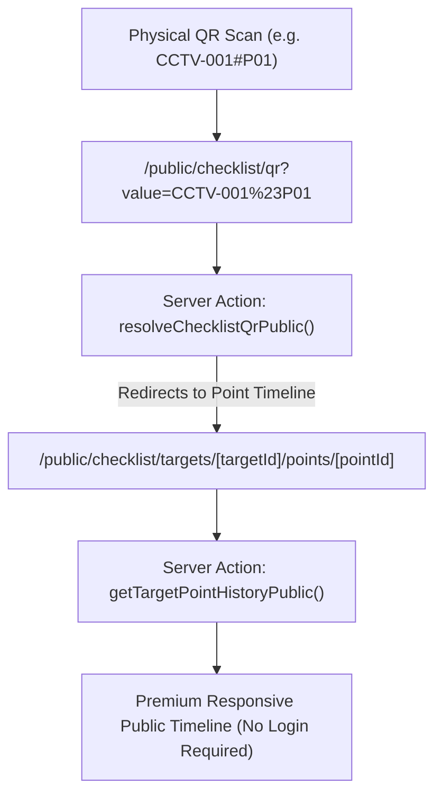

# Public_Checklist_Point_History_004: Public QR Checklist Point History & Photo Log Resolver

## Objective
Implement a public-facing QR-code lookup page and a point-specific history timeline page. This enables unauthenticated users (e.g., facility inspectors or managers scanning a physical QR code on-site) to view the history and photo evidence of a specific inspection point (e.g., CCTV Camera P01 to P06) without logging in.

## Background & Current Limitation
- **Current State:** The system tracks point-level checklist history using `photos_by_point` and `photo_meta_by_point`. The resolution and query logic reside in `resolveChecklistQr` and `getTargetPointHistory` within `app/actions/target.js`.
- **Limitation:** These actions are protected by `requireAdminProfile()`, which throws an error if the user is not authenticated or lacks the admin role. 
- **Goal:** Enable safe, read-only public access to non-sensitive point histories (asset name, checked time, status, and photos) for anyone scanning a physical point QR code.

## Solution Architecture & Design



## Scope & Implementation Tasks

### 1. Public Server Actions
Create safe, public-friendly actions in `app/actions/target.js` or in a new module `app/actions/public-checklist.js`:
- `resolveChecklistQrPublic(qrCode)`:
  - Fetches the target or point matching the QR code (e.g. split prefix/suffix on `#`).
  - Does NOT enforce `requireAdminProfile()`.
  - Returns a redirection url pointing to `/public/checklist/targets/[targetId]/points/[pointId]`.
  - Implements a basic query rate limiter or error handler to prevent database scraping.
- `getTargetPointHistoryPublic(targetId, pointId)`:
  - Fetches the target and its document history for the specific point.
  - Sanitizes the output: strictly excludes sensitive columns, user metadata, or admin-only details. Returns only `name`, `target_code`, `location`, `point_id`, and a timeline array with `checked_at`, `status`, `photo_url`, and `meta` (GPS/timestamp details).

### 2. Public QR Resolver Page
Create `app/public/checklist/qr/page.js` (Server Component):
- Parses the URL search parameter `value` (e.g., `/public/checklist/qr?value=CCTV-001%23P01`).
- Invokes `resolveChecklistQrPublic(value)`.
- If successful, redirects to the public point history page.
- If not found or fails, renders a premium fallback/error screen with a "Scan Again" button.

### 3. Public Point Timeline Page
Create `app/public/checklist/targets/[targetId]/points/[pointId]/page.js` (Server Component):
- **Next.js 15 Compliance:** Since dynamic parameters are async in Next.js 15, await `params` first:
  ```javascript
  const { targetId, pointId } = await params
  ```
- Calls `getTargetPointHistoryPublic(targetId, pointId)`.
- Renders a **Premium, Gorgeous Glassmorphism mobile-friendly UI** (DOWA Premium styling) showing:
  - A beautiful top card with Target Name (e.g., "CCTV Box 01"), Code, and Location.
  - A vertical timeline of point-level history.
  - The photo taken during each check, showing a full-screen preview when tapped/clicked.
  - Verification badges: "GPS Verified" (if photo coordinates align with target coordinates) or "Standard Check".
  - Sleek hover micro-animations and smooth transitions.

### 4. Standards Integration
- Update `docs/standards/QR_ASSET_HISTORY.md` to document the public endpoint design, schemas, and security boundaries.

### 5. Automated Tests
- Create `/tests/public-checklist.test.js` verifying that:
  - `resolveChecklistQrPublic` and `getTargetPointHistoryPublic` are accessible without a logged-in user profile.
  - Private tables and sensitive user parameters are never returned.
  - The resolution logic correctly handles prefixes/suffixes divided by `#`.

---
*Created by Antigravity on 2026-05-17.*
