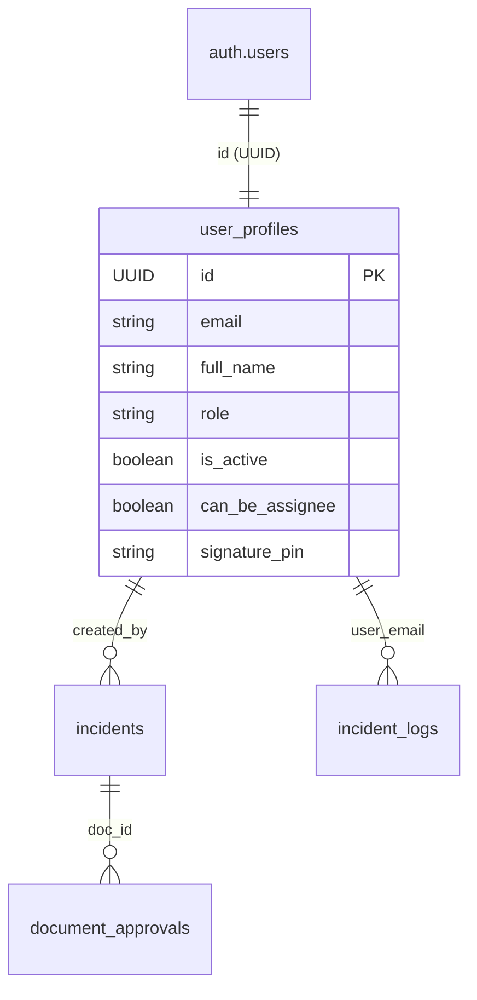

# 📘 DOWA IT System - Technical Documentation (Multi-Tier RBAC)

เอกสารฉบับนี้สรุปโครงสร้างระบบบริหารจัดการผู้ใช้ (User Management) และการรักษาความปลอดภัยที่มีการแบ่งเป็น 4 ระดับ (Tiers) เพื่อใช้เป็นมาตรฐานในการพัฒนาและแก้ไขระบบ

---

## 1. Data Structure & Relations (โครงสร้างฐานข้อมูล)

ระบบใช้ฐานข้อมูล Supabase โดยแบ่งการจัดเก็บผู้ใช้เป็น 2 ประเภทหลักที่เชื่อมโยงกันด้วย **Email** ผ่านตารางกลาง (Bridge Table)

### 🧩 ตารางหลัก
### 1. Unified Identity Strategy
- **Core Platform**: Supabase Auth (Email/Password & Microsoft 365 SSO)
- **Source of Truth**: `user_profiles` (Single table for all roles)
- **Unified Auth Flow**: All users (Administrator to Guest) use a single login interface.

#### Data Relation (Unified)

#### Incident Management Schema (Standardized)
- **`incidents`**: ตารางหลักเก็บข้อมูลใบแจ้งซ่อม/ปัญหา
  - `id`: UUID (PK)
  - `case_number`: Text (Unique - Document No.)
  - `title`: Text (หัวข้อปัญหา)
  - `description`: Text (รายละเอียด)
  - `status`: Text (Document Status: Open, In Progress, Pending Approval, Closed)
  - `workflow_status`: Text (Workflow Engine Status: draft, pending, approved, rejected)
  - `severity`: Text (High, Medium, Low)
  - `category`: Text (ประเภทปัญหา)
  - `affected_system`: Text (ระบบที่ได้รับผลกระทบ)
  - `reported_by`: Text (ชื่อผู้แจ้ง - สำหรับแสดงผล)
  - `created_by`: UUID (FK -> `user_profiles.id`) - ผู้ที่สร้างเอกสารในระบบ
  - `assigned_to`: Text (ชื่อผู้รับผิดชอบ)
  - `assigned_approver_id`: UUID (FK -> `user_profiles.id`) - ผู้อนุมัติปัจจุบันตาม Workflow

> [!NOTE]
> **Legacy Deprecation:** The tables `user_registry` and `external_users` are now deprecated and will be removed in future updates.

---

## 2. Multi-Tier RBAC (Unified Tiers)

All tiers now use standard authentication protocols.

| Tier | Role Name | Access Level | Auth Method |
| :---: | :--- | :--- | :--- |
| **Tier 1** | administrator | Full System Control | Email/Pass or M365 |
| **Tier 2** | supervisor | Operation & Reports | Email/Pass or M365 |
| **Tier 3** | approval | Specific Case Approvals | Email/Pass or M365 |
| **Tier 4** | guest | Create/View Incidents | Email/Pass or M365 |

> [!IMPORTANT]
> **Normalization:** ระบบใช้ฟังก์ชัน `normalizeRole()` ใน `lib/auth.js` เพื่อแปลงค่าเก่า (เช่น `superuser` -> `administrator`, `visitor` -> `guest`) ให้เป็นมาตรฐานเดียวกันก่อนแสดงผลหรือเช็คสิทธิ์

---

## 3. Module & Function Mapping (ตำแหน่งของฟังก์ชัน)

### 🛡️ Admin Operations (การจัดการโดย Admin)
**File Path:** `app/actions/admin.js`
- `createAdminUser`: สร้างผู้ใช้ใหม่ (แยก Logic ตาม Tier)
- `updateAdminUser`: แก้ไขข้อมูลทั่วไป/สถานะ Active
- `updateAdminUserPassword`: Reset รหัสผ่านให้ Staff (Internal)
- `updateAdminUserPIN`: Reset PIN 6 หลักให้ Guest/Approval (External)

### 🔑 Authentication & Self-Service (การเข้าสู่ระบบและจัดการตนเอง)
**File Path:** `app/actions/auth.js`
- `unifiedLogin`: ระบบ Login ตัวเดียวที่เช็คทั้ง Password และ PIN
- `getCurrentUserSession`: ดึงข้อมูลผู้ใช้ปัจจุบัน (รองรับทั้ง Cookie และ Supabase Session)
- `changeExternalPIN`: ฟังก์ชันให้ Guest เปลี่ยน PIN ด้วยตัวเอง (ต้องเช็ค PIN เดิม)

### 🏗️ Shared Library
**File Path:** `lib/auth.js`
- `ROLE_MAP`: การจับคู่ชื่อ Role
- `ROUTE_PERMISSIONS`: การกำหนดสิทธิ์เข้าถึงแต่ละหน้า (Access Control)
- `ROLE_BADGE`: ข้อมูลสีและ Emoji ของแต่ละบทบาท

---

## 4. Security Protocols (ระเบียบความปลอดภัย)

1.  **Password (Internal):** บังคับขั้นต่ำ 8 ตัวอักษร, มีอักษรพิมพ์ใหญ่, พิมพ์เล็ก, ตัวเลข และอักขระพิเศษ
2.  **PIN (External):** บังคับเป็น **ตัวเลข 6 หลักเท่านั้น**
3.  **Encryption:** ทั้ง Password และ PIN จะถูกเข้ารหัสแบบ One-way Hash ก่อนลง Database เสมอ (Password โดย Supabase / PIN โดย Bcrypt)
4.  **Session Management:**
    - Staff ใช้ Supabase Session (JWT ใน Cookie `sb-access-token`)
    - External ใช้ Custom Cookie (Cookie `guest-session` เข้ารหัส Base64)

---
## 5. Workflow & Approval Engine (ระบบอนุมัติ)

ระบบใช้มาตรฐาน **Unified Workflow Engine** เพื่อจัดการลำดับการอนุมัติแบบ Dynamic รองรับการตั้งค่าผ่านหน้าเว็บและเก็บประวัติการอนุมัติ (Audit Trail) แบบรวมศูนย์ในตารางเดียว

**รายละเอียดมาตรฐาน:** `docs/standards/WORKFLOW_ENGINE.md`

---
## 6. User Management Workflow (กระบวนการจัดการผู้ใช้)

เพื่อให้การบำรุงรักษาระบบเป็นไปอย่างถูกต้อง นี่คือลำดับการทำงาน (Flow) ของระบบจัดการผู้ใช้:

### 1. การสร้างบัญชี (User Creation)
- **จุดเริ่มต้น:** หน้าจอ Admin Dashboard -> `createAdminUser`
- **ขั้นตอน:**
    1. สร้างบัญชีใน **Supabase Auth** (Email/Password)
    2. นำ Email มาทำ **SHA-256 Hash** แล้วบันทึกลงใน `user_whitelist` (Double-Lock Step)
    3. บันทึกข้อมูลส่วนตัว (Role, Name) ลงใน `user_profiles`
- **หมายเหตุ:** หากขั้นตอนใดล้มเหลว ระบบจะทำการ Rollback หรือแจ้งเตือนจุดที่ผิดพลาดชัดเจน

### 2. การเข้าสู่ระบบ (Authentication)
- **จุดเริ่มต้น:** หน้า Login -> `unifiedLogin`
- **ขั้นตอนการตรวจสอบ:**
    1. **Whitelist Check:** ระบบจะนำ Email มา Hash และเช็คใน `user_whitelist` ก่อนเป็นด่านแรก (ถ้าไม่มีสิทธิ์จะถูกบล็อกทันที)
    2. **Auth Check:** ตรวจสอบรหัสผ่านผ่าน Supabase Auth หรือตรวจสอบ Microsoft SSO
    3. **Role Validation:** ดึงข้อมูล Role จาก `user_profiles` เพื่อกำหนดสิทธิ์การเข้าถึงหน้าต่างๆ
- **Session:** สร้าง JWT สำหรับพนักงาน และ Custom Cookie สำหรับ Guest/Approval

### 3. การตรวจสอบสิทธิ์ (Security Definition)
- **Handle New User:** ใช้ Database Trigger `handle_new_user()` ที่เป็น `SECURITY DEFINER` เพื่อให้ระบบสามารถเขียนข้อมูลลง Profile ได้อย่างปลอดภัยแม้ผู้ใช้จะยังไม่มีสิทธิ์ในตอนแรก

---
## 7. Dynamic Checklist Engine (Next-Gen Framework)

ระบบโครงสร้าง Checklist แบบใหม่ที่ทำงานตาม Template 5 รูปแบบหลัก เพื่อรองรับการตรวจสอบที่ซับซ้อน:

### 🧩 Data Models (โครงสร้างข้อมูล)
- **`checklist_templates`**: ตาราง Master เก็บโครงสร้างหลัก
  - `ui_template_type`: 1-5 (ตามประเภท Template)
  - `template_config`: JSONB (เก็บค่าคอนฟิก เช่น จุดถ่ายภาพ, เกณฑ์วัด, ขั้นตอน SOP)
- **`checklist_documents`**: ตารางคุมเอกสารการตรวจแต่ละครั้ง
  - `document_type`: Daily/Weekly/Monthly/Yearly
  - `target_date`: วันที่เป้าหมายของการตรวจ
- **`checklist_results`**: ตารางเก็บผลการตรวจรายหัวข้อ
  - `template_data`: JSONB (เก็บข้อมูลจริง: URL รูป, ค่าที่วัดได้, ผลการเซ็นชื่อ)
  - `status`: Auto-calculated (OK/Fail) ตามเงื่อนไขของแต่ละ Template

### 🎨 The 5 Templates
1. **Photo Evidence**: ตรวจสภาพทางกายภาพ บังคับอัปโหลดรูปตามจุดที่กำหนด + Auto Timestamp
2. **Procedure Table**: ตารางขั้นตอน SOP สำหรับงานซ้อมแผน/บำรุงรักษา + Smart Plan Selection
3. **Measurement & Threshold**: กรอกค่าตัวเลขตรวจสอบกับเกณฑ์ (Min/Max) + Real-time Validation
4. **Link & Service Verification**: ตรวจสอบ URL/Portal สำหรับงาน Monitoring + Note Enforcement
5. **Sign-off / Approval**: ระบบอนุมัติหลายระดับ (Multi-role) รองรับการเซ็นชื่อตามลำดับ

## 📋 Dynamic Checklist Engine Architecture
ระบบ Checklist รูปแบบใหม่ที่ขับเคลื่อนด้วย JSONB Configuration เพื่อรองรับการตรวจงานที่หลากหลาย

### Workflow: จากการตั้งค่าสู่การปฏิบัติ
1. **Configuration (Master Data):**
   - Administrator กำหนด `ui_template_type` (T1-T5) ใน Checklist Master
   - ตั้งค่า `template_config` (JSON) เช่น จุดถ่ายภาพ, เกณฑ์วัดค่า (Min/Max), หรือแผน SOP
2. **Execution (Checklist Dashboard):**
   - User สร้างเอกสาร Checklist ตามความถี่ (Daily, Monthly, etc.)
   - ระบบ Render UI ตาม Template ที่ตั้งค่าไว้
   - **Auto-OK Engine:** ตรวจสอบข้อมูลที่กรอก (เช่น ครบทุกรูป, ค่าอยู่ในเกณฑ์) และเปลี่ยนสถานะหัวข้อเป็น OK อัตโนมัติ
3. **Data Persistence:**
   - ผลการตรวจถูกเก็บลงใน `checklist_items.template_data` (JSONB)
   - ข้อมูลรูปภาพถูกบีบอัด (< 150kb) และประทับลายน้ำ (Timestamp Guard) ก่อนบันทึก
4. **Audit & Incident:**
   - หากตรวจพบความผิดปกติ (NG) ระบบรองรับการเปิด **Incident Case** เชื่อมโยงกับหัวข้อนั้นทันที
