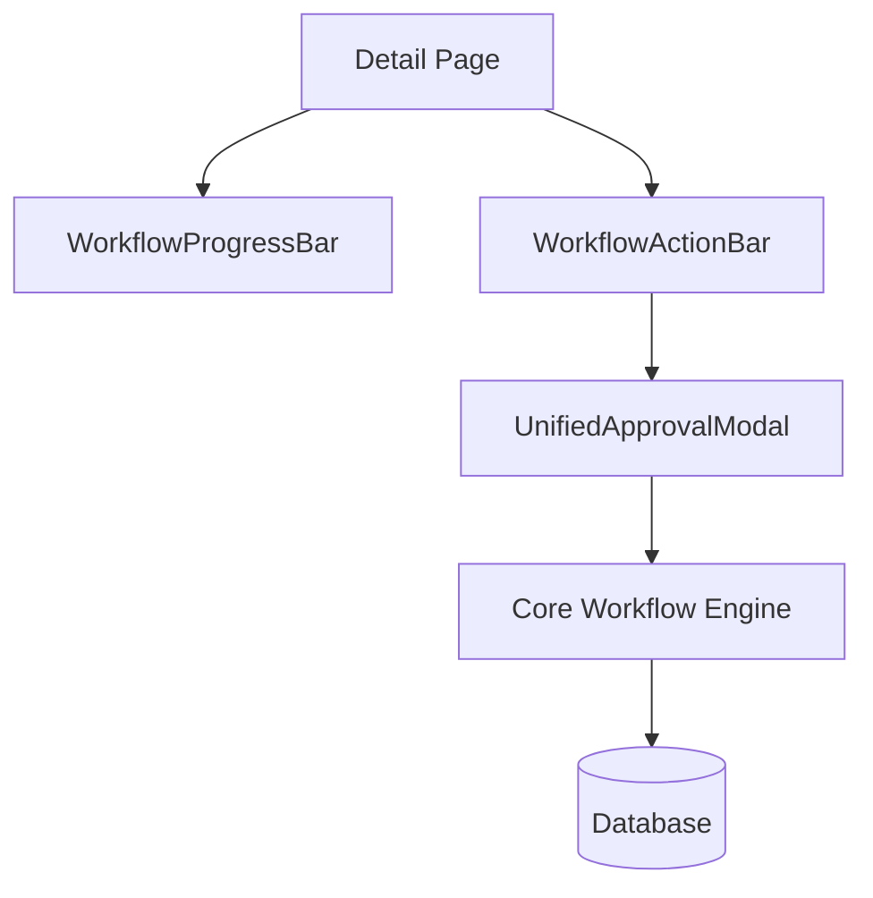

# แผนการพัฒนามาตรฐาน Workflow และการอนุมัติ (Unified Workflow Standard)

**วันที่เริ่มต้น**: 08-May-2026
**สถานะ**: กำลังดำเนินการ (Execution Phase)
**วัตถุประสงค์**: ปรับปรุงโครงสร้างการอนุมัติเอกสารทั้งระบบ (Incident & Checklist) ให้เป็นมาตรฐานเดียวกัน โดยรองรับทั้งการอนุมัติด้วยตนเอง (Direct) และการเซ็นแบบรีโมท (Remote PIN) ผ่าน Core Function เดียวกัน

## 📋 แผนการดำเนินงาน (Execution Plan)

### 1. การปรับปรุง Backend (Core Engine)
- [x] อัปเดต `app/actions/workflow.js` ให้รองรับการตรวจสอบ PIN และการอนุมัติในฟังก์ชันเดียว
- [x] เพิ่มระบบจัดการ Exception สำหรับกรณีพิเศษของแต่ละโมดูล (โมดูลใดต้องการ Step แบบไหน)

### 2. การสร้าง Shared UI Components (มาตรฐานกลาง)
- [x] **WorkflowProgressBar**: แถบแสดงสถานะ 1-2-3 (อยู่ที่ `@/components/workflow/`)
- [x] **UnifiedApprovalModal**: หน้าต่างเซ็นชื่อแบบรวมศูนย์ รองรับ Remote PIN
- [x] **WorkflowActionBar**: แถบปุ่มกดด้านล่างที่เปลี่ยนไปตามสิทธิ์และลำดับคิว

### 3. การทำ Refactoring รายโมดูล
- [x] **Incident Module**: ติดตั้ง Shared Component และระบบ Resolve ใหม่เรียบร้อยแล้ว
- [x] **Checklist Module**: ติดตั้ง Shared Component และปรับปรุง UI เป็นมาตรฐานเดียวกันเรียบร้อยแล้ว
- [x] **Security Patch**: แก้ไขช่องโหว่ PIN Verification Loophole (Enforced Server-side PIN check for remote signatures)
- [x] **Logging**: เพิ่มระบบ `recordAuditLog` เพื่อรองรับการรวม Log ในอนาคต

## 🛡️ ผลการ Audit และข้อเสนอแนะเพิ่มเติม (Audit & Security Review)

จากการตรวจสอบระบบในวันที่ 08-May-2026 พบจุดที่ต้องเฝ้าระวังและปรับปรุงดังนี้:

### จุดแข็ง (Strengths)
- **Centralized Logs**: ข้อมูลการอนุมัติรวมศูนย์อยู่ที่ตาราง `document_approvals` ทำให้ตรวจสอบข้ามโมดูลได้ง่าย
- **Standardized UI**: การมี Shared Component ช่วยลดความซ้ำซ้อนของ Code และทำให้ User Experience เป็นอันหนึ่งอันเดียวกัน

### จุดที่ต้องระวัง (Risks)
- **PIN Verification Loophole**: ปัจจุบัน Backend เชื่อถือ Flag `verifiedByPin` จาก Frontend ควรอัปเดต `submitApprovalStep` ให้ทำการ Verify PIN ซ้ำที่ฝั่ง Server เสมอหากเป็นการอนุมัติแทน (Remote)
- **Data Inconsistency**: การอัปเดตข้อมูลหลายตารางพร้อมกัน (เช่น ปิด Incident + บันทึก Log + อัปเดต Checklist) ควรใช้ **Database Transactions** เพื่อป้องกันข้อมูลไม่ตรงกันหากระบบขัดข้องระหว่างทาง
- **Logging Redundancy**: มีการบันทึก Log ซ้ำซ้อนทั้งในตาราง Audit ของโมดูลและตาราง Workflow ในอนาคตควรพิจารณายุบรวมเป็น `system_audit_logs` ที่เดียว

## 🏗️ โครงสร้างที่ออกแบบไว้

---
*บันทึกและตรวจสอบโดย AI Agent (Antigravity) ตามคำสั่ง USER*
