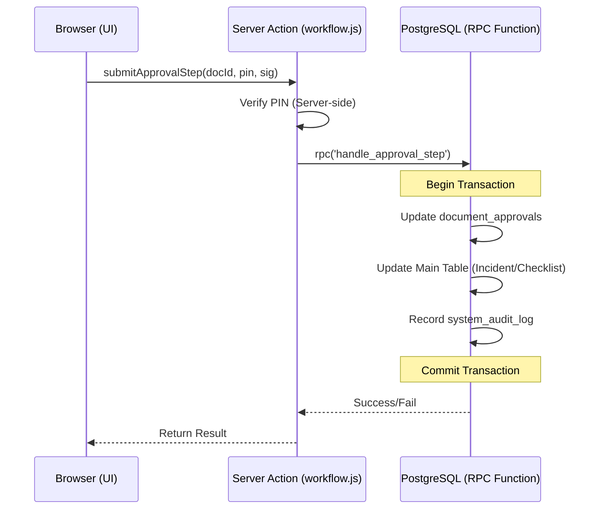

# แผนการปรับปรุงความเสถียรของระบบ Workflow (Workflow Refinement Phase 2)

**วันที่จัดทำ**: 08-May-2026
**สถานะ**: รอดำเนินการ (Drafted for Next Agent)
**เป้าหมาย**: เพิ่มความน่าเชื่อถือของข้อมูล (Data Integrity) ผ่านระบบ Database Transactions และรวมศูนย์ระบบ Logging ให้เป็นมาตรฐานเดียวกันทั้งระบบ

---

## 🛠️ รายการที่ต้องปรับปรุง (Task List)

### 1. Database Transactional Hardening (Priority: High)
ป้องกันปัญหาข้อมูลไม่ตรงกัน (Data Inconsistency) เมื่อมีการอัปเดตหลายตารางพร้อมกัน
- **จุดที่ต้องแก้ไข**: ฟังก์ชัน `submitApprovalStep` ใน `app/actions/workflow.js`
- **แนวทาง**:
    - ย้าย Logic การอัปเดตสถานะ (Update `document_approvals` + Update Main Table + Record Log) ไปไว้ใน **PostgreSQL RPC (Stored Procedure)**
    - เรียกใช้ผ่าน `supabase.rpc('handle_approval_step', { ... })` เพื่อให้การทำงานเป็นแบบ Atomic (สำเร็จทั้งหมดหรือล้มเหลวทั้งหมด)
- **ตารางที่เกี่ยวข้อง**: `document_approvals`, `incidents`, `checklist_docs`, `system_audit_logs`

### 2. Centralized Audit Log Migration (Priority: Medium)
ยุบรวม Log จากหลายตารางมาไว้ที่ `system_audit_logs` เพียงที่เดียว
- **ตารางที่จะยุบ**: `checklist_logs`, `incident_logs`
- **แนวทาง**:
    - สร้างตาราง `system_audit_logs` (หากยังไม่มี) โดยมี Column: `doc_id`, `doc_type`, `action`, `details`, `user_email`, `metadata`
    - แก้ไขฟังก์ชัน `recordAuditLog` ใน `workflow.js` ให้บันทึกลงตารางกลางเพียงที่เดียว
    - ทำการ Data Migration ย้าย Log เก่าจากตารางเดิมเข้าสู่ตารางใหม่
- **ผลลัพธ์**: Dashboard สามารถ Query Log ทุกประเภทได้จากตารางเดียว (Single Source of Truth)

### 3. Workflow Engine Code Refactoring (Priority: Low)
ปรับปรุงคุณภาพโค้ดให้สม่ำเสมอและจัดการ Error ได้ดีขึ้น
- **แนวทาง**:
    - เปลี่ยนการสร้าง Supabase Client ใน `workflow.js` มาใช้ `getSupabaseAdmin` (Singleton) ทั้งหมดแทนการใช้ `createClient` แบบ manual
    - เพิ่มระบบ **Detailed Error Logging** บันทึกลงใน `system_logs` (Category: error) หาก Workflow ขั้นตอนใดขั้นตอนหนึ่งล้มเหลว
    - เพิ่มระบบ **Auto-Retry** สำหรับ Cross-module synchronization ในกรณีที่ API ภายนอกขัดข้อง

---

## 🛡️ มาตรฐานความปลอดภัย (Security Standard)
- บังคับใช้ **Server-side PIN Verification** ต่อไป (ห้ามลดระดับการตรวจสอบ)
- ห้ามใช้ **Client-side Logic** ในการตัดสินใจเปลี่ยนสถานะเอกสาร (ต้องผ่าน Server Action เท่านั้น)
- Log ทุกรายการต้องระบุ `user_email` หรือ `reported_by_id` ที่ระบุตัวตนได้จริง (Non-repudiation)

---

## 📈 แผนภาพการทำงานใหม่ (Proposed Architecture)

---
*จัดทำแผนโดย AI Agent (Antigravity) เพื่อส่งต่อให้ Agent ดำเนินการในลำดับถัดไป*
