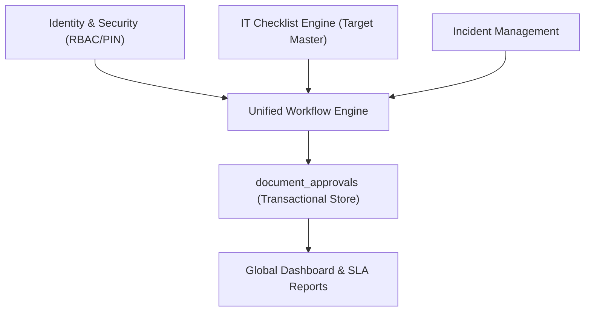

# 🏛️ DOWA IT System - Project Summary

เอกสารฉบับนี้เป็นรายงานสรุปโครงสร้างสถาปัตยกรรมและรายละเอียดโฟลเดอร์ระบบ **DOWA IT System** จากการตรวจสอบโค้ดจริง มาตรฐาน และความสัมพันธ์ระหว่างระบบ โดยจัดทำเป็นคู่มือภาพรวมเพื่อความเข้าใจในการพัฒนาต่อยอด UAT และการตรวจสอบประวัติระบบ (Audit Trail)

---

## 🚀 1. ข้อมูลและสแต็กเทคโนโลยี (Technology Stack)

ระบบ **DOWA IT System** เป็นเว็บแอปพลิเคชันเกรดพรีเมียมระดับองค์กร (Enterprise Application) ที่ถูกออกแบบมาเพื่อจัดการกระบวนการทำงานด้านไอทีขององค์กร DOWA THT แบบมีธรรมาภิบาลและความปลอดภัยระดับสูงสุด

*   **Core Framework:** [Next.js 15 (App Router)](file:///c:/Users/Lenovo/dowa-it-system/app)
*   **Design & UI System:** Tailwind CSS v4 ร่วมกับ CSS Explicit เกรดพรีเมียม (ดีไซน์ Glassmorphism รองรับ Multi-Device อย่างสมบูรณ์แบบตามมาตรฐาน [UI_UX_RESPONSIVE.md](file:///c:/Users/Lenovo/dowa-it-system/docs/standards/UI_UX_RESPONSIVE.md))
*   **Database Management:** Supabase (PostgreSQL)
*   **Authentication & Security:** Supabase Auth + Microsoft 365 SSO + Local Password + Double-Lock **6-digit PIN System** (เก็บความลับแบบ Bcrypt Hash ภายใต้ตาราง `user_profiles`)
*   **Transactional Engine:** Server Actions (Next.js) แยกการประมวลผล Logic ออกจาก Client-side อย่างเป็นรูปธรรมเพื่อความปลอดภัยของสิทธิ์
*   **Automated Verification:** ระบบทดสอบอัตโนมัติ [tests/](file:///c:/Users/Lenovo/dowa-it-system/tests) สำหรับการยืนยันผลระบบ (npm test)

---

## 🧠 2. สถาปัตยกรรมโมดูลหลัก (Core Modules & Engines)

ระบบถูกออกแบบโดยยึดความเสถียรและมาตรฐานของตารางข้อมูลเป็นหลัก โดยประกอบด้วย Engine สำคัญ 5 ส่วน:

### 1) Identity & Security (ระบบสิทธิ์และความปลอดภัยแบบรวมศูนย์)
*   **Source of Truth:** ตาราง `user_profiles` ร่วมกับตาราง `user_whitelist`
*   **ระดับของสิทธิ์ (RBAC):** มี 5 บทบาทหลัก ได้แก่ `admin`, `it_staff`, `approver`, `employee`, และ `auditor`
*   **ความปลอดภัย:**
    *   การทำกิจกรรมสำคัญ (เช่น อนุมัติเบิก/อนุมัติปิดเคส) ต้องผ่านการกรอก PIN 6 หลักที่ผ่านการเข้ารหัส Bcrypt
    *   มีระบบ Lockout เมื่อกด PIN ผิดเกิน 5 ครั้งจะถูกระงับสิทธิ์ชั่วคราว 30 นาที
    *   ระบบการลงนามแทน (Remote Approval) หาก Admin/IT ได้รับการยืนยัน PIN จากผู้อนุมัติจริง

### 2) Unified Workflow Engine (ระบบการทำงานแบบอนุมัติร่วม)
*   **จุดประสงค์:** จัดการลำดับขั้นและสิทธิ์การลงนามเซ็นเอกสารของทุกตารางในระบบ
*   **ฐานข้อมูล:** ตาราง `document_approvals` (เก็บขั้นตอนการเซ็นและประวัติการลงนาม)
*   **Logic การประมวลผล:** [workflow.js](file:///c:/Users/Lenovo/dowa-it-system/app/actions/workflow.js) ตรวจสิทธิ์และสร้าง Sequence การอนุมัติอัตโนมัติตามประเภทเอกสาร

### 3) Incident Management Module (ระบบจัดการเหตุการณ์และปัญหาไอที)
*   **จุดประสงค์:** ตรวจสอบกระบวนการตั้งแต่การรับแจ้งเหตุขัดข้อง จนกระทั่งแก้ไขและปิดงาน
*   **Logic การประมวลผล:** [incidents.js](file:///c:/Users/Lenovo/dowa-it-system/app/actions/incidents.js) ควบคุมการยอมรับงานด้วยสิทธิ์ `it_staff` และการมอบหมายงานด้วยสิทธิ์ `admin` ตามหลักการตรวจสอบความถูกต้องด้านความปลอดภัย (Audit-Safe Workflow)
*   **SLA Engine:** คำนวณระยะเวลาแก้ไขปัญหาแบบวินาทีต่อวินาที โดยอ้างอิงและหักออกด้วยปฏิทินวันหยุดประจำปี ([holidays](file:///c:/Users/Lenovo/dowa-it-system/app/dashboard/settings/holidays/page.js)) และเวลาปิดทำการขององค์กรจริง ผ่าน [slaUtils.js](file:///c:/Users/Lenovo/dowa-it-system/lib/slaUtils.js)

### 4) IT Checklist Engine & Target Registry (ระบบเช็คลิสต์และบันทึกรายอุปกรณ์)
*   **จุดประสงค์:** ควบคุมการทำความสะอาด ตรวจเช็ค และบำรุงรักษาอุปกรณ์ทางไอทีในระดับรายอุปกรณ์
*   **ความสามารถหลัก:**
    *   **Stable Point-Identity:** การเก็บข้อมูลประวัติตรวจรายข้อด้วย ID (Snapshot-First) แทนการอ้างอิงตำแหน่ง Array ช่วยรักษาประวัติย้อนหลังได้ยาวนาน
    *   **QR Deep-Linking:** สแกน QR Code แล้วสามารถนำทางพาเจ้าหน้าที่เข้าไปทำแบบทดสอบหรือตรวจสอบประวัติเครื่องในหน้าจอประวัติอุปกรณ์ได้ทันที
    *   **Dual-Write Architecture:** การจัดเก็บภาพหลักฐานคู่ขนานรองรับทั้งโครงสร้างข้อมูลใหม่และเก่าสำหรับช่วงการนำร่อง UAT
    *   **Photo Geolocation:** สนับสนุนการเปิดใช้ตำแหน่งพิกัด GPS อัตโนมัติร่วมกับภาพถ่ายหลักฐานเพื่อการตรวจสอบความสัตย์จริงในการลงพื้นที่

### 5) Global Dashboard & Reporting (หน้าจอรายงานผลสัมฤทธิ์)
*   คำนวณและแสดงปริมาณงานรวมที่ผู้ใช้ค้างอนุมัติผ่าน Badge ด้านบนระบบ
*   แสดงผล SLA ประจำเคสและค่า KPI ของศูนย์ไอทีแบบเรียลไทม์

---

## 📂 3. รายละเอียดและข้อมูลของ Root Folder ทั้งหมด

จากการตรวจสอบโครงสร้างที่จัดเก็บไฟล์ของโปรเจกต์ มีความหมายและการจัดเก็บข้อมูลดังต่อไปนี้:

| ชื่อโฟลเดอร์หลัก (Root Folder) | หน้าที่และประเภทข้อมูลที่จัดเก็บ |
| :--- | :--- |
| **[app/](file:///c:/Users/Lenovo/dowa-it-system/app)** | **Next.js App Router Core:** รวบรวมสถาปัตยกรรมการเปลี่ยนหน้าและกระบวนการประมวลผลเบื้องหลังทั้งหมด • `actions/` – โค้ด Server Actions สำหรับ Logic การทำงานกับฐานข้อมูล เช่น workflow, incident, target • `dashboard/` – ส่วนระบบหลังบ้านของผู้ใช้ที่ล็อกอิน (incidents, checklist, settings) • `api/` – จุดสิ้นสุด API สำหรับ QR code lookup และการสื่อสารข้อมูลภายนอก • `auth/`, `onboarding/`, `reset-pin/` – ระบบการระบุตัวตนและตั้งค่าความปลอดภัยบัญชี |
| **[components/](file:///c:/Users/Lenovo/dowa-it-system/components)** | **UI Shared Components:** เก็บองค์ประกอบหน้าจอที่ใช้ซ้ำเพื่อรักษาเอกภาพของดีไซน์พรีเมียม • `workflow/` – กล่องป๊อปอัปอนุมัติ UnifiedApprovalModal, แถบความคืบหน้า WorkflowProgressBar • `DashboardHeader.js` – แถบหัวระบบสำหรับแสดงจำนวนงานและโปรไฟล์ผู้ใช้ |
| **[lib/](file:///c:/Users/Lenovo/dowa-it-system/lib)** | **Core Logic & Libraries:** เก็บโมดูลประมวลผลที่เกี่ยวข้องกับตรรกะทางธุรกิจที่ปราศจากโค้ด UI • `slaUtils.js` – ระบบประเมินวันทำงานและคำนวณเวลา SLA ตามปฏิทินจริง • `noSeries.js` – ระบบสร้างเลขที่เอกสารความปลอดภัยสูง • `checklistTemplateValidation.js` – ระบบยืนยันข้อมูลความเข้ากันได้ของโครงสร้างเทมเพลต • `supabaseServer.js` – การเชื่อมโยงฝั่งเซิร์ฟเวอร์แบบจำกัดสิทธิ์ความปลอดภัยสูงสุด |
| **[docs/](file:///c:/Users/Lenovo/dowa-it-system/docs)** | **Project Documentation Index:** คลังความรู้มาตรฐานและประวัติการพัฒนาโครงการ • `standards/` – เอกสารความต้องการเชิงพัฒนาของ Agent และโครงสร้างระบบ (ZERO_HACK, UI_UX_SETTINGS) • `history/` – บันทึกสรุปงานค้าง แผนการพัฒนา และบันทึกประวัติการเปลี่ยนแปลงรายวัน (CHANGELOG) • `manuals/` – คู่มือช่วยเหลือผู้ใช้และแผนนำข้อมูล UAT เข้าสู่ระบบ |
| **[supabase/](file:///c:/Users/Lenovo/dowa-it-system/supabase)** | **Supabase Configuration:** ไฟล์การอัปเดตและเก็บประวัติทางโครงสร้างตารางและนโยบายความปลอดภัยฐานข้อมูล • `migrations/` – ลำดับสคริปต์ SQL ที่ใช้เปิดโครงตารางและระบบนโยบายล็อกระดับแถว (RLS Policies) |
| **[scripts/](file:///c:/Users/Lenovo/dowa-it-system/scripts)** | **Database Scripts:** สำหรับการ Migration ข้อมูล และสคริปต์ช่วยเหลือนักพัฒนาในการตั้งค่าสิทธิ์หรือจำลองข้อมูลทดสอบ (เช่น การนำร่อง seed ข้อมูล UAT) |
| **[scratch/](file:///c:/Users/Lenovo/dowa-it-system/scratch)** | **Development Workspace:** โฟลเดอร์รวมไฟล์ตรวจสอบตัวแปร เช็คค่าฐานข้อมูล และรันแก้ไขข้อผิดพลาดเร่งด่วนโดยนักพัฒนา ซึ่งจะไม่ส่งผลกระทบต่อคุณภาพของซอร์สโค้ดหลัก |
| **[tests/](file:///c:/Users/Lenovo/dowa-it-system/tests)** | **Automated Testing Suites:** สำหรับเก็บบททดสอบการทำงานของ REST API, Target Registry, และ Logic การคำนวณเวลา เพื่อเป็นเกณฑ์ป้องกันการพังของระบบตามกฎ Pre-delivery Test |
| **[ai-tasks/](file:///c:/Users/Lenovo/dowa-it-system/ai-tasks)** | **AI Collaboration Workflow:** จุดแลกเปลี่ยนสเปกงานระหว่าง Smart AI และ Fast AI |
| **[public/](file:///c:/Users/Lenovo/dowa-it-system/public)** | **Static Assets:** ภาพประกอบ ไอคอน และโลโก้องค์กร DOWA |

---

## 🔄 4. รายงานงานค้างและขั้นตอนการพัฒนาถัดไป (UAT Reminder)

จากการสแกนความต้องการทางระบบล่าสุด มีสถานะงานที่จำเป็นต้องนำเสนอแด่ USER ดังนี้ครับ:

> [!IMPORTANT]
> **การดำเนินการถัดไปเพื่อนำระบบเข้าสู่ UAT:**
> 1.  **Review คู่มือการ Seed ข้อมูล UAT:** USER ควรศึกษาลำดับแผนงานในเอกสาร [TARGET_REGISTRY_UAT_SEED_PLAN.md](file:///c:/Users/Lenovo/dowa-it-system/docs/manuals/TARGET_REGISTRY_UAT_SEED_PLAN.md)
> 2.  **การยืนยันการนำเข้าข้อมูลจำลอง:** รันคำสั่ง SQL ใน [seed_target_registry_uat.sql](file:///c:/Users/Lenovo/dowa-it-system/scripts/seed_target_registry_uat.sql) เพื่อสถาปนาข้อมูลอุปกรณ์ CCTV Terminal Box ตัวอย่างในการทดสอบสแกน QR และเช็คประวัติจริง
> 3.  **ความปลอดภัย:** หากเกิดความเสียหาย สามารถทำการดึงสคริปต์ [rollback_seed_target_registry_uat.sql](file:///c:/Users/Lenovo/dowa-it-system/scripts/rollback_seed_target_registry_uat.sql) มาลบตารางข้อมูลที่เกินมาได้อย่างรวดเร็ว

---

จัดทำโดย **Antigravity (AI Coding Partner)**
*วันที่ 17 พฤษภาคม 2569 (11:20 น.)*
