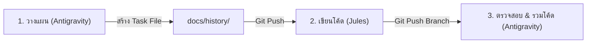

# 🤝 คู่มือการประสานงาน AI ร่วมกัน: Antigravity & Google Jules

คู่มือฉบับนี้จัดทำขึ้นเพื่อกำหนดกรอบการทำงานร่วมกันระหว่าง **Antigravity (Local Smart AI)** และ **Google Jules (Cloud Fast AI)** ในการพัฒนาและดูแลรักษาโครงการ DOWA IT System อย่างมีประสิทธิภาพสูงสุด

---

## 🎭 การแบ่งบทบาทหน้าที่ (Role & Responsibilities)

เพื่อให้ทำงานร่วมกันได้อย่างมีประสิทธิภาพโดยไม่มีการเขียนโค้ดทับซ้อนหรือขัดแย้งกัน ระบบได้แบ่งบทบาทของ AI ออกเป็น 2 ระดับ:

| คุณสมบัติ / บทบาท | 🛸 Antigravity (Local Smart AI) | ⚡ Google Jules (Cloud Fast AI) |
|---|---|---|
| **ตำแหน่งการทำงาน** | เครื่องคอมพิวเตอร์ของคุณ (Local Workspace) | ระบบคลาวด์บนเซิร์ฟเวอร์ GitHub (Cloud Sandbox) |
| **บทบาทหลัก (Role)** | **ผู้วางแผนและสถาปนิก (Smart AI / Architect)** | **ผู้ลงมือโค้ดและรันคอมไพล์ (Fast AI / Executor)** |
| **จุดเด่นทางเทคนิค** | <ul><li>เข้าถึงเว็บบราวเซอร์ผ่าน Playwright แบบเห็นภาพ</li><li>สืบค้นประวัติระบบและการสนทนาย้อนหลังได้ลึกซึ้ง</li><li>ประสานงานและตรวจรับงาน/Conflict จากคลาวด์</li></ul> | <ul><li>ประมวลผลโค้ดขนาดใหญ่ (Massive codebase) ได้รวดเร็ว</li><li>สร้าง ค้นหา และแก้ไขไฟล์ปริมาณมากในระบบคลาวด์</li><li>ทดสอบ Codebase แบบแยกเป็นอิสระ (Sandbox Isolation)</li></ul> |
| **เครื่องมือหลัก (Tools)** | `view_file`, `write_to_file`, `run_command`, `browser_subagent` | `jules run <task_file>` |

---

## 🔄 ขั้นตอนและโฟลเดอร์การทำงานร่วมกัน (Collaboration Workflow)

ความร่วมมือแบบ 100% Zero-Conflict ทำงานผ่าน 3 ขั้นตอนหลัก:



### 1. ขั้นตอนที่ 1: วางแผนและสร้างคำสั่ง (Planning Phase) — ทำโดย **Antigravity**
*   **สิ่งที่ต้องทำ:** เมื่อคุณมีโจทย์ใหม่หรือต้องการแก้ไขระบบขนาดใหญ่ ให้คุยกับ **Antigravity** เพื่อให้วิเคราะห์โครงสร้างโค้ดและสร้างแผนงาน
*   **ผลลัพธ์:** Antigravity จะเขียนไฟล์ `.md` แผนงานเทคนิคละเอียดถึงระดับ Pseudocode ไว้ที่โฟลเดอร์ `docs/history/` จากนั้นจะทำการ Push ขึ้น GitHub

### 2. ขั้นตอนที่ 2: รันโค้ดบนคลาวด์ (Execution Phase) — ทำโดย **Google Jules**
*   **สิ่งที่ต้องทำ:** คุณสั่งรันไฟล์คำสั่งผ่าน Jules บนคลาวด์:
    ```bash
    jules run docs/history/ชื่องาน_00X.md
    ```
*   **ผลลัพธ์:** Jules จะสแกนโค้ดและดำเนินการสร้าง/แก้ไขโค้ดจริงทั้งหมดบนกิ่งสาขา (Branch) ใหม่บน GitHub เมื่อเสร็จแล้ว Jules จะทำการทดสอบและสร้างรายงานความสำเร็จ

### 3. ขั้นตอนที่ 3: ตรวจสอบและดึงงานลง localhost (Verification Phase) — ทำโดย **Antigravity**
*   **สิ่งที่ต้องทำ:** คุยกับ **Antigravity** เพื่อดึงโค้ดของ Jules ลงมาที่ Localhost
*   **ผลลัพธ์:** Antigravity จะทำ `git fetch` และผสานโค้ด (Git Merge) ให้คุณโดยอัตโนมัติ พร้อมทั้งรัน `npm test` เพื่อตรวจสอบความสมบูรณ์และรายงานผลการรันก่อนคุณเริ่มรันเซิร์ฟเวอร์ใช้งาน

---

## 🛠️ ตัวอย่างการเลือกใช้เครื่องมือตามประเภทงาน (Task Mapping)

| ประเภทงาน (Task Type) | ควรใช้ใคร? (Who to use?) | ขั้นตอนที่แนะนำ (Recommended Steps) |
|---|---|---|
| **ออกแบบ Database หรือวางแผนระบบใหม่** | **Antigravity** | คุยกับ Antigravity เพื่อให้ออกแบบ Schema และเขียนแผนงานลง `docs/history/` |
| **สร้างหน้าจอ (UI/UX) / API Endpoint ใหม่ยกชุด** | **Google Jules** | ส่งต่อแผนงานให้ Jules รันโค้ดบนคลาวด์ เพื่อความรวดเร็วและไม่กระทบ localhost ระหว่างทำ |
| **แก้ Bug ซับซ้อน หรือระบบขัดข้องที่หาสาเหตุไม่ได้** | **Antigravity** | ใช้ Antigravity ตรวจสอบ logs และวิเคราะห์โค้ดจริงใน localhost |
| **อัปเกรดเวอร์ชันของ Library (เช่น Next.js 16)** | **Google Jules** | ใช้พลังประมวลผลของ Jules บนคลาวด์เพื่อตรวจหาจุด Breaking Changes ทั้งระบบในคราวเดียว |
| **ตรวจสอบหน้าจอการแสดงผลด้วยภาพ (Visual UI Check)** | **Antigravity** | ใช้เครื่องมือ `browser_subagent` ของ Antigravity ในการเปิดหน้าเว็บจริง แคปรูปภาพ และตรวจสอบความสวยงาม |
| **รวมโค้ดและตรวจสอบความถูกต้องก่อนส่งงาน** | **Antigravity** | ให้ Antigravity ดำเนินการรันชุดทดสอบ `npm test` และทำ Git Pull เพื่อจบงานอย่างปลอดภัย |

---
*จัดทำขึ้นเพื่อให้ระบบพัฒนา DOWA IT System มีเสถียรภาพและคุณภาพสูงสุด*
