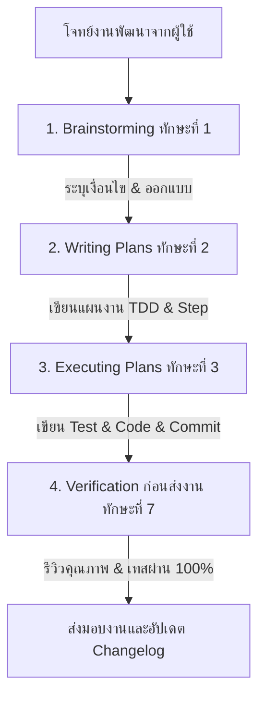

# 🦸‍♂️ Superpowers Skills Library Integration Guide

เอกสารฉบับนี้กำหนดมาตรฐานการใช้งานและระเบียบปฏิบัติสำหรับ **Superpowers Skills Library (v5.1.0)** ซึ่งเป็นกรอบการทำงานเชิงระบบ (Systematic Framework) ที่ประยุกต์ใช้เพื่อควบคุมพฤติกรรมและการทำงานของ AI Agents ทุกตัวในโครงการ DOWA IT System (รวมถึง Antigravity, Google Jules, Cursor AI, Windsurf, และ Copilot) 

การประสานพลังของเครื่องมือนี้จะช่วยยกระดับความน่าเชื่อถือ คุณภาพโค้ด และความปลอดภัยในการพัฒนาให้อยู่ในระดับสูงสุด (Audit-Ready)

---

## 🏛️ 1. กฎเหล็กในการใช้งาน (Rule of Engagement)

> [!IMPORTANT]
> **MANDATORY FOR ALL AI AGENTS:**
> หากมีความเป็นไปได้แม้เพียง **1%** ที่จะมีทักษะ (Skill) หรือแนวทางในห้องสมุดนี้เกี่ยวข้องกับงานที่ได้รับมอบหมาย **AI Agent ต้องเปิดอ่านและปฏิบัติตามทักษะที่เกี่ยวข้องทันทีโดยไม่มีข้อยกเว้น** ห้ามใช้ข้ออ้างว่า "งานนี้เรียบง่ายเกินไป" หรือ "แก้ไขเพียงเล็กน้อย" เพื่อละเว้นกระบวนการทำงานที่ระบุไว้

### ลำดับความสำคัญในการยึดถือคำสั่ง (Instruction Priority)
1. **User's Explicit Instructions & Agent Rules:** คำสั่งโดยตรงจากผู้ใช้ รวมถึงกฎใน [AGENTS.md](file:///c:/Users/Lenovo/dowa-it-system/AGENTS.md) และ [.julesrules](file:///c:/Users/Lenovo/dowa-it-system/.julesrules) มีผลบังคับใช้สูงสุด
2. **Superpowers Skills:** ทักษะในห้องสมุดนี้จะมีผลบังคับใช้เหนือกว่าพฤติกรรมดั้งเดิมของ AI (Default AI behavior)
3. **Default AI Knowledge:** ความรู้เดิมในระบบ AI (มีผลบังคับใช้น้อยที่สุด)

---

## 🗺️ 2. สารบัญทักษะความสามารถ (Superpowers Skills Index)

ห้องสมุดทักษะแบ่งออกเป็น 14 ทักษะหลัก ครอบคลุมตั้งแต่การออกแบบ วางแผน เขียนโค้ด ทดสอบ ดีบั๊ก จนถึงการส่งมอบงาน:

| ทักษะ (Skill) | วัตถุประสงค์หลัก (Purpose) | ลิงก์เข้าถึงเอกสารหลัก (SKILL.md) | เอกสารประกอบ / พร้อมต์รีวิว |
| :--- | :--- | :--- | :--- |
| **1. Brainstorming** | การระดมความคิด วิเคราะห์โจทย์ สอบถามคำถามทีละข้อ และเขียน Spec ก่อนลงมือทำ | [SKILL.md](file:///c:/Users/Lenovo/dowa-it-system/docs/standards/superpowers/brainstorming/SKILL.md) | - [spec-document-reviewer-prompt.md](file:///c:/Users/Lenovo/dowa-it-system/docs/standards/superpowers/brainstorming/spec-document-reviewer-prompt.md) - [visual-companion.md](file:///c:/Users/Lenovo/dowa-it-system/docs/standards/superpowers/brainstorming/visual-companion.md) |
| **2. Writing Plans** | การแปลง Spec เป็นแผนการพัฒนาที่มีความละเอียดสูง (Step-by-Step TDD Plan) | [SKILL.md](file:///c:/Users/Lenovo/dowa-it-system/docs/standards/superpowers/writing-plans/SKILL.md) | - [plan-document-reviewer-prompt.md](file:///c:/Users/Lenovo/dowa-it-system/docs/standards/superpowers/writing-plans/plan-document-reviewer-prompt.md) |
| **3. Executing Plans** | การปฏิบัติตามแผนการพัฒนาอย่างเป็นขั้นตอน มี Checkpoints และ Git Commit เสมอ | [SKILL.md](file:///c:/Users/Lenovo/dowa-it-system/docs/standards/superpowers/executing-plans/SKILL.md) | - |
| **4. Subagent Development** | การกระจายงานให้ AI ผู้ลงมือ (Implementer) และแบ่งขั้นตอนรีวิวคุณภาพเป็น 2 ระดับ | [SKILL.md](file:///c:/Users/Lenovo/dowa-it-system/docs/standards/superpowers/subagent-driven-development/SKILL.md) | - [implementer-prompt.md](file:///c:/Users/Lenovo/dowa-it-system/docs/standards/superpowers/subagent-driven-development/implementer-prompt.md) - [spec-reviewer-prompt.md](file:///c:/Users/Lenovo/dowa-it-system/docs/standards/superpowers/subagent-driven-development/spec-reviewer-prompt.md) - [code-quality-reviewer-prompt.md](file:///c:/Users/Lenovo/dowa-it-system/docs/standards/superpowers/subagent-driven-development/code-quality-reviewer-prompt.md) |
| **5. Test Driven Development** | มาตรฐานการเขียน Test ก่อนลงมือเขียนโค้ด (Red-Green-Refactor Cycle) | [SKILL.md](file:///c:/Users/Lenovo/dowa-it-system/docs/standards/superpowers/test-driven-development/SKILL.md) | - [testing-anti-patterns.md](file:///c:/Users/Lenovo/dowa-it-system/docs/standards/superpowers/test-driven-development/testing-anti-patterns.md) |
| **6. Systematic Debugging** | การค้นหาและแก้ไขข้อผิดพลาดโดยอาศัยสมมติฐานและการพิสูจน์ (Hypothesis Testing) | [SKILL.md](file:///c:/Users/Lenovo/dowa-it-system/docs/standards/superpowers/systematic-debugging/SKILL.md) | - [root-cause-tracing.md](file:///c:/Users/Lenovo/dowa-it-system/docs/standards/superpowers/systematic-debugging/root-cause-tracing.md) - [defense-in-depth.md](file:///c:/Users/Lenovo/dowa-it-system/docs/standards/superpowers/systematic-debugging/defense-in-depth.md) - [condition-based-waiting.md](file:///c:/Users/Lenovo/dowa-it-system/docs/standards/superpowers/systematic-debugging/condition-based-waiting.md) |
| **7. Verification Before Completion** | การสแกนโค้ดและรันคอมไพล์เพื่อยืนยันว่างานเสร็จสิ้นสมบูรณ์ 100% | [SKILL.md](file:///c:/Users/Lenovo/dowa-it-system/docs/standards/superpowers/verification-before-completion/SKILL.md) | - |
| **8. Using Git Worktrees** | การพัฒนาฟีเจอร์ในสภาพแวดล้อมที่แยกเฉพาะ (Isolated Git Worktrees) | [SKILL.md](file:///c:/Users/Lenovo/dowa-it-system/docs/standards/superpowers/using-git-worktrees/SKILL.md) | - |
| **9. Using Superpowers** | วิธีการเข้าถึงและเรียกใช้ความสามารถของห้องสมุดในหลากหลายแพลตฟอร์ม | [SKILL.md](file:///c:/Users/Lenovo/dowa-it-system/docs/standards/superpowers/using-superpowers/SKILL.md) | - [references/gemini-tools.md](file:///c:/Users/Lenovo/dowa-it-system/docs/standards/superpowers/using-superpowers/references/gemini-tools.md) |
| **10. Finishing Dev Branch** | มาตรฐานการทำความสะอาด ลบ worktree, สควอช และผสานโค้ดเข้ากิ่งหลัก | [SKILL.md](file:///c:/Users/Lenovo/dowa-it-system/docs/standards/superpowers/finishing-a-development-branch/SKILL.md) | - |
| **11. Requesting Code Review** | รูปแบบการส่งมอบโค้ดให้เพื่อนร่วมงาน/มนุษย์ตรวจสอบ | [SKILL.md](file:///c:/Users/Lenovo/dowa-it-system/docs/standards/superpowers/requesting-code-review/SKILL.md) | - [code-reviewer.md](file:///c:/Users/Lenovo/dowa-it-system/docs/standards/superpowers/requesting-code-review/code-reviewer.md) |
| **12. Receiving Code Review** | วิธีการน้อมรับและจัดการแก้ไขตามคำสั่งของคณะผู้ตรวจสอบ | [SKILL.md](file:///c:/Users/Lenovo/dowa-it-system/docs/standards/superpowers/receiving-code-review/SKILL.md) | - |
| **13. Dispatching Parallel Agents** | การแบ่งงานให้ AI ย่อยรันทำงานขนานกันอย่างเป็นระบบ | [SKILL.md](file:///c:/Users/Lenovo/dowa-it-system/docs/standards/superpowers/dispatching-parallel-agents/SKILL.md) | - |
| **14. Writing Skills** | วิธีการสร้างหรืออัปเกรดมาตรฐานทักษะความสามารถใหม่ๆ | [SKILL.md](file:///c:/Users/Lenovo/dowa-it-system/docs/standards/superpowers/writing-skills/SKILL.md) | - [anth persuasion principles](file:///c:/Users/Lenovo/dowa-it-system/docs/standards/superpowers/writing-skills/persuasion-principles.md) |

---

## 🔄 3. วงจรการพัฒนาตามแบบแผน (Unified Development Lifecycle)

ทุกครั้งที่ต้องดำเนินการแก้ไขโค้ดที่แตะต้อง Business Logic หรือโครงสร้างระบบ AI Agent จะต้องดำเนินตามแบบแผน 4 ขั้นตอนนี้เสมอ:

### ขั้นตอนการดีบั๊กอย่างเป็นระบบ (Systematic Debugging Workflow)
เมื่อเกิดปัญหาระบบหรือ Bug:
1. **ระบุอาการ (Symptoms):** บันทึกสิ่งที่เกิดขึ้นจริงเทียบกับสิ่งที่คาดหวัง
2. **สร้างสมมติฐาน (Hypothesis):** เขียนอภิปรายเหตุผลว่าสาเหตุที่น่าจะเป็นคืออะไร (ห้ามเดาสุ่มแก้ไขโค้ด)
3. **ออกแบบการพิสูจน์ (Verification Plan):** หาวิธีสร้างสภาวะแวดล้อมให้ปัญหานั้นปรากฏ (เช่น การเขียน Test หรือ Script)
4. **แก้ไขและเพิ่มมาตรการป้องกัน (Fix & Defend):** แก้ไขโค้ดและสร้าง Test ครอบคลุมเพื่อป้องกันไม่ให้บั๊กนี้กลับมาอีก

---

## 🔌 4. การผสานระบบเข้ากับโครงการ (Platform Integration)

### การทำงานร่วมกับ Cursor AI / Windsurf
ในไฟล์ `.cursorrules` ของโครงการ มีการอ้างอิงให้ AI เข้ามาอ่านคู่มือฉบับนี้และปรับพฤติกรรมโดยใช้ Superpowers Skills ทันทีในการเริ่มต้นการสนทนา:
*   เมื่อตรวจจับคำสั่งสร้าง ฟีเจอร์ หรือปรับปรุงโครงสร้าง AI จะสลับไปรัน **Brainstorming** เป็นกระบวนการแรกสุด
*   มีการจำกัดไม่ให้ AI พัฒนาฟีเจอร์โดยปราศจากการเขียน Test (TDD) และไม่มีการใช้ Placeholders ในโค้ด

### การทำงานร่วมกับ Google Jules (Cloud Coding Agent)
การประสานพลังกับ Google Jules:
1. **Antigravity (Local Smart AI)** จะรันกระบวนการ **Brainstorming & Writing Plans** เพื่อเขียนแผนงานที่สมบูรณ์แบบปราศจาก Placeholders ไว้ในโฟลเดอร์ [ai-tasks/tasks/](file:///c:/Users/Lenovo/dowa-it-system/ai-tasks/tasks/)
2. แผนงานดังกล่าวจะระบุการรัน **Test Driven Development (TDD)** ในทุกขั้นตอนย่อย
3. **Google Jules (Cloud Fast AI)** จะทำการดึงแผนงานนั้นและดำเนินงานทีละขั้นอย่างเคร่งครัด รัน `npm test` และส่ง Commit กลับขึ้น GitHub
4. **Antigravity** ทำหน้าที่ตรวจรับงานตามกระบวนการ **Verification Before Completion**

---

> [!TIP]
> การจัดเก็บทักษะความสามารถไว้ที่ `docs/standards/superpowers/` เพื่อความสะดวกในการสืบค้น ค้นหา และอ้างอิงข้อมูลของ AI Agents ทุกตัวในเครื่อง Localhost
