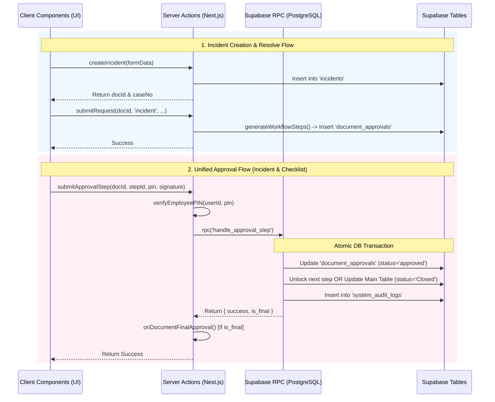

# 🗺️ System Architecture Map (Unified Version)

เอกสารฉบับนี้เป็น Aggregation Tool ส่วนกลางสำหรับ Agent และทีมพัฒนา เพื่อทำความเข้าใจโครงสร้างทางเทคนิค, Data Tables, Logic Flows และความเสี่ยงของระบบทั้งหมดแบบ End-to-End (อัปเดตสถานะและซิงค์ข้อมูลตามผลสแกน ณ วันที่ 17 พฤษภาคม 2569 12:50)

---

## 🏗️ 1. Core Architecture & Tech Stack
ระบบ DOWA IT System ถูกออกแบบตามหลัก Enterprise & Zero-Trust Architecture โดยใช้เทคโนโลยีดังนี้:
- **Core Framework**: Next.js 15 (App Router) + React 19
- **Styling**: Tailwind CSS v4 (ประมวลผลเร็วพิเศษ) ใช้ร่วมกับ `clsx` และ `tailwind-merge` ผ่าน [lib/cn.js](file:///c:/Users/Lenovo/dowa-it-system/lib/cn.js) เพื่อควบคุม Spacing และ UI Consistent
- **Database & Auth**: Supabase (PostgreSQL, Supabase Auth และ SSR Client บน Server Components/Actions)
- **Security & Validation**: Bcrypt (สำหรับ Hash PIN 6 หลัก), Zod (สำหรับสแกนและ Validate โครงสร้างข้อมูลก่อนบันทึก)
- **Integrations**: Resend (สำหรับบริการส่งอีเมลแจ้งเตือน), Microsoft Graph API (สำหรับเชื่อมต่อและอัปโหลดรูปภาพหลักฐานความละเอียดสูงเข้า OneDrive)
- **UI Libraries**: Recharts (สำหรับการทำ Data Visualization บน Dashboard), `react-signature-canvas` (สำหรับการเซ็นชื่อแบบดิจิทัล)

---

## 📂 2. Directory Structure & Conventions
ระบบมีการจัดเก็บและแยก Module ตามมาตรฐานอย่างเข้มงวด:
- `app/actions/`: ศูนย์รวม Business Logic ทั้งหมด (Server Actions) ทำงานฝั่ง Server เพื่อความปลอดภัยสูงสุด (Zero-Trust)
- `app/api/`: Route Handlers สำหรับบริการภายนอก เช่น Onboarding Init, Webhooks, QR Lookup, และ Auth Callbacks
- `app/dashboard/`: หน้าจอ UI หลักของระบบสำหรับผู้ใช้ที่ Login แล้ว แบ่งออกเป็นหน้า Incidents, Checklist, Reports และ Settings
- `components/`: Shared UI Components ที่ใช้ร่วมกัน เช่น `WorkflowActionBar`, `UnifiedApprovalModal`
- `lib/`: Core Utilities เช่น [slaUtils.js](file:///c:/Users/Lenovo/dowa-it-system/lib/slaUtils.js) (คำนวณเวลา SLA), [workflowRegistry.js](file:///c:/Users/Lenovo/dowa-it-system/lib/workflowRegistry.js) (ตั้งค่าประเภทตารางเอกสาร) และ [supabaseAdmin.js](file:///c:/Users/Lenovo/dowa-it-system/lib/supabaseAdmin.js) (High-Privilege Service Role Client)
- `docs/`: แหล่งเก็บเอกสารแยกตามประเภท Standards (กฎ/Logic), History (บันทึก/Audit) และ Manuals (คู่มือ/UAT)
- `supabase/migrations/`: ไฟล์ SQL สำหรับควบคุม Schema Database, ตารางข้อมูล, RLS Policies และ RPC Database Functions

---

## 🧠 3. Unified Workflow Engine
ระบบกลางจัดการลำดับการอนุมัติ (Approval Sequence) ของทุกโมดูลแบบบูรณาการผ่านตารางเดี่ยว

### **Key Components**
- **Table**: `document_approvals` (Transactional tracking ราย Step)
- **Logic Handler**: [app/actions/workflow.js](file:///c:/Users/Lenovo/dowa-it-system/app/actions/workflow.js) (Monolithic Control Engine)
- **Registry**: [lib/workflowRegistry.js](file:///c:/Users/Lenovo/dowa-it-system/lib/workflowRegistry.js) (จับคู่ประเภทเอกสารกับตารางจริง)
- **UI Component**: `components/workflow/UnifiedApprovalModal.js`

### **Workflow Lifecycle**
1. **Submit (`submitRequest`)**: เมื่อผู้ใช้ส่งเอกสาร ระบบจะดึง Config จาก `workflow_configs` เพื่อสร้างขั้นตอนใน `document_approvals` ผ่าน `generateWorkflowSteps`
2. **Dynamic Resolution**: เรียก `syncDynamicWorkflowApprovers` เพื่อดึงข้อมูลผู้อนุมัติแบบไดนามิก (เช่น หากบทบาทเป็น Reporter ระบบจะดึง UUID ของผู้แจ้งซ่อมจากเอกสารมาเติมให้อัตโนมัติ)
3. **PIN & Signature Verification**: ในขั้นตอนอนุมัติ ระบบจะใช้ `verifyEmployeePIN` ตรวจสอบความถูกต้องของ PIN 6 หลักของผู้เซ็น ก่อนส่งคำสั่งไปยัง PostgreSQL RPC `handle_approval_step` เพื่อดำเนินการแบบ Transaction
4. **Finalize (`onDocumentFinalApproval`)**: เมื่อขั้นตอนสุดท้ายได้รับการอนุมัติสำเร็จ ระบบจะเปลี่ยนสถานะหลักเป็น `Closed` และเรียก Side-effects ข้ามโมดูลอัตโนมัติ

---

## 🆘 4. Incident Management Module
ระบบจัดการปัญหาไอทีแบบ End-to-End ตั้งแต่การแจ้งซ่อม มอบหมายงาน คำนวณ SLA ตลอดจนกระบวนการอนุมัติและปิดเคส

### **Key Components**
- **Table**: `incidents` (ตารางหลัก)
- **Logs**: `incident_logs` และ `system_audit_logs` (มีการเขียนแบบ Dual-write เพื่อ Backward Compatibility)
- **Logic Handler**: [app/actions/incidents.js](file:///c:/Users/Lenovo/dowa-it-system/app/actions/incidents.js)
- **SLA Engine**: [lib/slaUtils.js](file:///c:/Users/Lenovo/dowa-it-system/lib/slaUtils.js) (คำนวณเวลาการแก้ไข)

### **State Flow**
- **Open**: เคสใหม่ที่เพิ่งสร้าง รอผู้ดูแลระบบ IT รับเรื่องและกำหนดผู้รับผิดชอบ
- **In Progress**: เปลี่ยนสถานะอัตโนมัติเมื่อเจ้าหน้าที่ IT กดรับเรื่องหรือ Admin ทำการมอบหมายงาน (Acknowledge/Dispatch)
- **Pending Approval**: สถานะเมื่อเจ้าหน้าที่กดแก้ไขปัญหาสำเร็จ (Resolve) และเข้าสู่ขั้นตอนการเก็บลายเซ็น
- **Closed**: การแก้ไขปัญหาเสร็จสมบูรณ์และได้รับอนุมัติครบถ้วน (เวลา SLA จะหยุดนับ)

---

## 📋 5. IT Checklist Engine
ระบบการตรวจความพร้อมและการตรวจสอบ (Inspection Framework) ตามรอบเวลา (Daily, Weekly, Monthly, Yearly) ทำงานร่วมกับ JSONB Configuration เพื่อความยืดหยุ่นสูง

### **Key Components**
- **Tables**: `checklist_docs`, `checklist_items`, `checklist_templates`
- **Logic Handler**: [app/actions/dashboard.js](file:///c:/Users/Lenovo/dowa-it-system/app/actions/dashboard.js) & [lib/checklistItems.js](file:///c:/Users/Lenovo/dowa-it-system/lib/checklistItems.js)
- **Image Cloud Storage**: อัปโหลดและประทับลายน้ำ (Watermark Timestamp Guard) เพื่อป้องกันการทุจริต ก่อนบันทึกรูปเข้า OneDrive ผ่าน `/api/upload/onedrive`

### **The 5 Advanced Templates**
1. **Photo Evidence (T1)**: บังคับถ่ายภาพตามตำแหน่งที่ระบุพร้อมเช็ค Timestamp
2. **Procedure Table (T2)**: ตารางตรวจสอบลำดับ SOP และ Smart Plan Selection
3. **Measurement & Threshold (T3)**: กรอกตัวเลขจริง ตรวจสอบความถูกต้องตามเกณฑ์ Min/Max อัตโนมัติ
4. **Link & Service Verification (T4)**: ตรวจสุขภาพระบบหรือ API Link พร้อมบังคับจดบันทึก
5. **Sign-off / Approval (T5)**: กระบวนการเซ็นชื่อและยืนยันแบบ Multi-role

> [!NOTE]
> **Auto-OK Engine:** ระบบจะสแกนข้อมูลที่ส่งเข้ามา หากผลการตรวจสอบผ่านเกณฑ์ทั้งหมด (เช่น มีการกรอกครบถ้วน ไม่มีค่าผิดปกติ) ระบบจะปรับสถานะหัวข้อเป็น `OK` อัตโนมัติ หากพบความผิดปกติ (`NG`) ระบบรองรับการเปิด **Incident Case** เพื่อแจ้งซ่อมทันที และหาก Incident นั้นถูกแก้ไขและปิดตัวลง (`Closed`) ระบบจะส่งสัญญาณ `onDocumentFinalApproval` ย้อนกลับมาปรับสถานะ Checklist Item เป็น `OK` อัตโนมัติ

---

## 👥 6. Identity & Security (The Unified Identity)
ระบบจัดการตัวตน สิทธิ์เข้าถึง และการป้องกันระดับสูง (Multi-Tier RBAC & Whitelist Gatekeeper)
- ** ตารางจัดเก็บ**: `user_profiles` (Source of Truth สำหรับสิทธิ์และลายเซ็นดิจิทัล)
- **Double-Lock Security**: การเช็ค Whitelist โดยนำอีเมลที่ใช้เข้ารหัส SHA-256 ไปตรวจสอบกับตาราง `user_whitelist` ในขณะล็อกอิน
- **SSO Integration**: รองรับทั้ง Microsoft 365 SSO และ Local Password
- **Roles (RBAC)**: แบ่งระดับการเข้าถึงเป็น 4 ระดับหลัก (`administrator`, `supervisor`, `approval`, `guest`) พร้อมฟังก์ชัน `normalizeRole()` ป้องกันค่าสิทธิ์ตกหล่น
- **PIN Verification**: ใช้ Bcrypt สำหรับการตรวจสอบ PIN 6 หลัก มี lockout system ป้องกัน Brute-force (จำกัดการกดผิด 5 ครั้ง ล็อก 30 นาที)
- **Remote Approval Mode**: เอื้ออำนวยให้หัวหน้างาน/ผู้อนุมัติสามารถป้อน PIN 6 หลักบนอุปกรณ์ของผู้แจ้งซ่อมเพื่อยืนยันการลงชื่อและตัวตนจริงได้ (Verified by PIN ประทับตราใน Audit Log อย่างโปร่งใส)

---

## 📊 7. SLA & Dashboard Engine
ระบบรวบรวมรายงาน ประเมินผลดัชนีชี้วัดความสามารถ (KPI) และการประมวลผลข้อมูลแบบเรียลไทม์
- **ฟังก์ชันหลัก**: `calculateNetBusinessMinutes` (ใน [lib/slaUtils.js](file:///c:/Users/Lenovo/dowa-it-system/lib/slaUtils.js#L20)) ทำหน้าที่แปลงเวลาเป็น Bangkok Time (UTC+7), สแกนเวลาทำการในแต่ละวันตาม `work_days` และ `holidays` ที่กำหนดไว้ในตารางระบบ, รวมถึงการหักลบช่วงเวลาที่ผู้แจ้งกดขอหยุดเวลา (Exclusions) แบบ Recursive
- **Dashboard API**: ฟังก์ชัน `getDashboardData` รวบรวมข้อมูลสถานะ Streak และตัวเลขการแจ้งซ่อมของพนักงานโดยใช้ Server Action

---

## 🛠️ 8. Maintenance & Audit Tools
- **Centralized Audit Trails**: `system_audit_logs` เป็นจุดรวมประวัติการเข้าใช้งานและการทำธุรกรรมทั้งหมดของระบบ โดยจัดเก็บเชิงลึกผ่านคอลัมน์ `metadata` (JSONB)
- **No Series Generation**: [lib/noSeries.js](file:///c:/Users/Lenovo/dowa-it-system/lib/noSeries.js) จัดการเรื่องเลขที่รันของเอกสารเพื่อป้องกันเอกสารซ้ำซ้อน
- **Database Migrations Control**: จัดการการเปลี่ยนแปลง Schema ทั้งหมดในโฟลเดอร์ `supabase/migrations/` (ห้ามมีการรัน SQL นอกกระบวนการควบคุม)

---

## 🔄 9. Core System Sequence Flows

---

## ⚙️ 10. Functional Inventory & Server Actions

| Function | File | Input Arguments | Output Format | Description & Core Responsibility |
| :--- | :--- | :--- | :--- | :--- |
| `cancelDocument` | [app/actions/workflow.js](file:///c:/Users/Lenovo/dowa-it-system/app/actions/workflow.js) | `docId: string, docType: string, reason: string, verification?: {pin?: string, otp?: string}` | `{ success: boolean, docNo?: string, error?: string, requiresVerification?: boolean }` | ยกเลิกเอกสาร Checklist หรือ Incident พร้อมตรวจสอบสิทธิ์ (Checklist: Creator/Admin, Incident: Reporter + PIN/OTP) |
| `requestIncidentCancelOTP` | [app/actions/workflow.js](file:///c:/Users/Lenovo/dowa-it-system/app/actions/workflow.js) | `docId: string` | `{ success: boolean, message?: string, error?: string }` | ส่ง OTP ไปยังอีเมลของผู้แจ้งเหตุ (Reporter) เพื่อยืนยันการยกเลิก Incident |
| `createIncident` | [app/actions/incidents.js](file:///c:/Users/Lenovo/dowa-it-system/app/actions/incidents.js) | `formData: FormData` | `{ success: boolean, docId: string, caseNo: string }` | ประมวลผลรันเลขเอกสาร IT, ตรวจสอบผู้แจ้งซ่อม, บันทึกข้อมูลตั้งต้น, แทรกในตาราง `incidents` และ `system_audit_logs` |
| `acknowledgeIncident` | [app/actions/incidents.js](file:///c:/Users/Lenovo/dowa-it-system/app/actions/incidents.js) | `id: string, severity: string, assigneeId: string` | `{ success: boolean, error?: string }` | อัปเดตการรับงานของเจ้าหน้าที่ IT หรือการจัดแจงมอบหมายงานโดย Admin พร้อมปรับสถานะเป็น `In Progress` และเริ่มนับ Resolution SLA |
| `submitRequest` | [app/actions/workflow.js](file:///c:/Users/Lenovo/dowa-it-system/app/actions/workflow.js) | `docId: string, targetType: string, triggerKey: string, userEmail: string, ...` | `{ success: boolean, autoApproved: boolean }` | ประมวลคำขอส่งอนุมัติเอกสาร และเริ่มกระบวนการสร้างและประเมินบันทึกลำดับลำดับอนุมัติหลักของระบบ |
| `submitApprovalStep` | [app/actions/workflow.js](file:///c:/Users/Lenovo/dowa-it-system/app/actions/workflow.js) | `docId: string, docType: string, stepId: string, signatureData: string, pin: string, ...` | `{ success: boolean, isFinal: boolean }` | ยืนยันรหัส PIN และสิทธิ์ ก่อนทำการเซ็นผ่านฐานข้อมูล โดยการสั่งการ RPC Function สำหรับอัปเดตสิทธิ์ธุรกรรม |
| `generateWorkflowSteps` | [app/actions/workflow.js](file:///c:/Users/Lenovo/dowa-it-system/app/actions/workflow.js) | `docId: string, targetType: string, configKey: string, triggerKey: string` | `{ success: boolean, autoApproved: boolean }` | สแกนและแทรกลำดับขั้นตอนอนุมัติลงใน `document_approvals` โดยอ้างอิงเงื่อนไข `workflow_configs` |
| `onDocumentFinalApproval` | [app/actions/workflow.js](file:///c:/Users/Lenovo/dowa-it-system/app/actions/workflow.js) | `docId: string, docType: string` | `Promise<void>` | ประมวล Side-effects ย้อนกลับเมื่อเอกสารอนุมัติครบถ้วน (เช่น ปิด Incident แล้วซิงค์ Checklist NG กลับเป็น OK) |
| `getSLAReportData` | `app/actions/reports.js` | `startDate: Date, endDate: Date, page: number` | `{ success: boolean, data: array, summary: object, settings: object }` | ดึงและตรวจสอบข้อมูลรายงาน SLA ตามช่วงเวลาแบบละเอียด |
| `calculateNetBusinessMinutes` | [lib/slaUtils.js](file:///c:/Users/Lenovo/dowa-it-system/lib/slaUtils.js) | `start: Date, end: Date, settings: object, holidays: array, exclusions: array` | `number` (นาทีทำการสุทธิ) | คำนวณเวลาที่ใช้ในการแก้ไขเคส โดยกรองวันทำการ นอกเวลา และ Pause Elements |
| `unifiedLogin` | `app/actions/login.js` | `email: string, password: string` | `{ success: boolean, needs_onboarding: boolean, ... }` | ประตูเข้าสู่ระบบหลัก (ตรวจสอบข้อมูล Whitelist และสิทธิ์) |
| `createAdminUser` | `app/actions/admin.js` | `email: string, password?: string, full_name: string, role: string, ...` | `{ success: boolean, error?: string }` | กระบวนการสร้าง User Account ปลอดภัย (Auth -> Whitelist -> Profile) |
| `getTargetAssetHistory` | `app/actions/target.js` | `targetId: string` | `{ success: boolean, target: object, docs: array }` | ดึงรายละเอียดประวัติการตรวจสอบของ Asset/Equipment เพื่อแสดงในหน้า QR History |
| `resolveChecklistQr` | `app/actions/target.js` | `qrCode: string` | `{ success: boolean, type: string, targetId: string, redirectUrl: string }` | วิเคราะห์และแปลงผล QR Code เป็น Link นำทางเพื่อเข้าดูข้อมูล Asset/Point |

---

## 🗄️ 11. Database Schema Reference

| Table Name | Primary Columns | Key Relations (Foreign Keys & Connections) | Description |
| :--- | :--- | :--- | :--- |
| **`user_profiles`** | `id` (UUID), `email`, `full_name`, `role`, `signature_pin`, `is_active` | FK ใน `created_by`, `reported_by_id`, `approver_id` ของทุกโมดูล | ตารางเก็บโปรไฟล์ ข้อมูลสิทธิ์ (RBAC) และ PIN ของผู้ใช้งานทุกคน |
| **`user_whitelist`** | `email_hash` (Text - SHA-256) | เชื่อมผ่าน Email Hash ตอนเข้าระบบ | ตัวคัดกรอง Whitelist เพิ่มเติมสำหรับการล็อกอินป้องกัน Ghost Users |
| **`incidents`** | `id` (UUID), `case_number`, `status`, `severity`, `reported_by_id`, `assigned_to` | `reported_by_id` -> `user_profiles.id`, เชื่อมโยง 1:N กับ `document_approvals` | ตารางควบคุมการแจ้งปัญหาไอทีและสถานะเคส |
| **`checklist_docs`** | `id` (UUID), `doc_no`, `freq_type`, `period_date`, `status`, `target_id` | `target_id` -> `checklist_targets.id`, เชื่อมโยง 1:N กับ `checklist_items` | ตารางคุมเอกสารตรวจสอบ Checklist ในแต่ละรอบการตรวจ |
| **`checklist_items`** | `id` (UUID), `doc_id`, `item_key`, `status`, `template_data` (JSONB) | `doc_id` -> `checklist_docs.id` | บันทึกผลการตรวจรายหัวข้อและ metadata เก็บภาพใน `template_data` |
| **`document_approvals`** | `id` (UUID), `doc_id`, `doc_type`, `step_order`, `approver_id`, `status` | `approver_id` -> `user_profiles.id` | ขั้นตอนการอนุมัติรายใบเอกสาร (รอ/ผ่าน/ตีกลับ) |
| **`system_audit_logs`** | `id` (UUID), `doc_id`, `doc_type`, `action`, `details`, `metadata` (JSONB) | เชื่อมกับ ID เอกสารหลักของทุกโมดูล | ตารางบันทึกความปลอดภัย ประวัติกิจกรรมการกดและแก้ไขทั้งหมด |
| **`checklist_targets`** | `id` (UUID), `target_code`, `target_type`, `qr_value`, `metadata` | 1:N กับ `checklist_docs` | ทะเบียนข้อมูล Asset หรือ จุดตรวจสอบหลักบน Physical Shopfloor |
| **`workflow_configs`** | `id` (UUID), `target_type`, `condition_key`, `condition_value`, `steps` (JSONB) | ใช้ประเมินเมื่อมีการ Submit เอกสาร | ตารางแม่บทที่ใช้กำหนดการรัน ลำดับขั้นผู้อนุมัติหลักของระบบ |

---

## ⚠️ 12. Technical Pitfalls & Performance Risks

> [!WARNING]
> **Performance Hotspot (lib/slaUtils.js - calculateNetBusinessMinutes):**
> มีการรัน `while` loop วนซ้ำทีละ 1 วันในการคำนวณวันทำการ หากเอกสารมีวันเริ่มต้นและสิ้นสุดห่างกันเป็นเวลานาน (เช่น ค้างข้ามปี) อาจเป็นสาเหตุให้ระบบเกิด CPU Bottleneck ได้ แม้ในตัวโค้ดจะมีเกราะป้องกันด้วยการจำกัดลูปสูงสุด `safetyCounter < 1000` ก็ตาม แต่ควรระมัดระวังในการส่งพารามิเตอร์ช่วงเวลาที่กว้างเกินไปเข้ามาคำนวณ

> [!WARNING]
> **High Concurrent Queries (app/actions/dashboard.js - getDashboardData):**
> ฟังก์ชันข้อมูลหน้า Dashboard ใช้ `Promise.all` ยิงพร้อมกันถึง 14 Queries รวมถึงการดึงประวัติ และคำนวณค่า Streak/SLA แบบ Real-time บนหน่วยความจำ การดึงข้อมูลลักษณะนี้ในขณะมีผู้ใช้งานสูงอาจก่อให้เกิดภาระหนักต่อฐานข้อมูล Supabase ได้ในระยะยาว

> [!IMPORTANT]
> **Monolithic Dependency Bottleneck (app/actions/workflow.js):**
> เป็น Server Action Monolithic ที่รวมเอาหน้าที่การอนุมัติ ตรวจสอบความถูกต้อง เชื่อมโยงข้ามโมดูล การบันทึก Logs ย้อนหลัง และการประเมินสิทธิ์ตัวตนทั้งหมดไว้ในไฟล์เดียว การแก้ไขจุดใดจุดหนึ่งในไฟล์นี้มีความเสี่ยงสูงที่จะก่อให้เกิดข้อผิดพลาดลูกโซ่ (Chain Reactions) ไปยังส่วนอื่นๆ ดังนั้นก่อนแก้ไขโค้ดทุกครั้งต้องตรวจสอบและทำ regression test อย่างละเอียด

> [!IMPORTANT]
> **Supabase Bypass Danger (lib/supabaseAdmin.js):**
> มีการเรียกใช้คีย์พิเศษ `SUPABASE_SERVICE_ROLE_KEY` สำหรับการเขียนทับข้อจำกัดความปลอดภัยของ Database RLS policies เพื่อความถูกต้องในการ onboarding และ auto-finalization ถึงแม้ตัวโค้ดจะถูกป้องกันด้วยคำสั่ง `"use server"` เพื่อจำกัดไว้ให้ทำงานฝั่ง Server เท่านั้น แต่ในการ refactor ห้ามเผลอ import คีย์นี้เข้าไปยังฝั่ง client-side component เด็ดขาด

> [!CAUTION]
> **Pending Security Migration (supabase/migrations/add_rls_policies.sql):**
> จากบันทึก Changelog ระบบมีการสร้างไฟล์การบังคับใช้ Row Level Security (RLS) จำนวน 18 ตารางข้อมูล ทว่าในปัจจุบัน *ตารางเหล่านี้ยังไม่ได้ถูกเปิดใช้งานจริงบน Production Database* เนื่องจากยังรอการตรวจรับและทดสอบระบบการเขียนเขียนข้อมูลผ่าน Client ปกติ การเปิดใช้งานในอนาคตจำเป็นต้องทำควบคู่กับการทดสอบสิทธิ์ผู้ใช้ (RBAC Checks) เพื่อไม่ให้สิทธิ์การกรอกข้อมูลและเข้าดูรายงานของระบบทั่วไปหยุดทำงาน

---
*Last Synchronized: 17-May-2026 12:50 | Document updated according to latest PROJECT_SCAN_SUMMARY.md*
